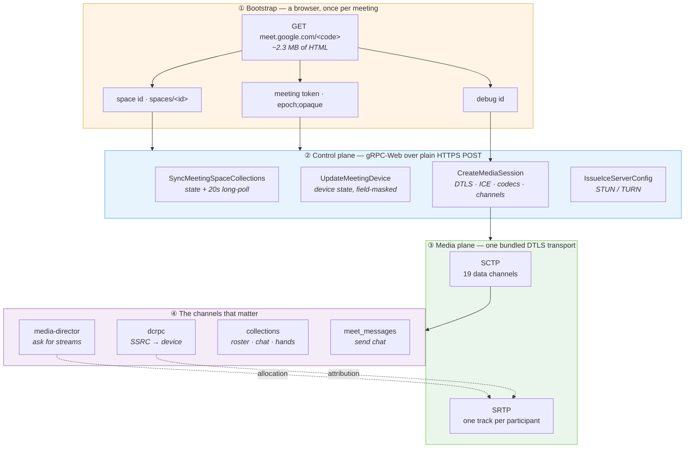

# The Google Meet protocol

**An observed specification of how a Google Meet client talks to Google.**

Google publishes none of this. Everything here was recovered by instrumenting a
real Chrome client, decoding what it sent, and then rebuilding each message from
scratch until Google accepted it. Where a claim has been reproduced by a
from-scratch client, it says so. Where it has only been observed, it says that
too.

This repository contains **information only** — no client, no bot, no
credentials. It exists so that someone can build one.

> **Snapshot:** Chrome 150 / Meet as served July 2026. This is a proprietary,
> unversioned, server-controlled protocol. Expect drift. See
> [capture methodology](docs/13-capture-methodology.md) to re-verify any of it.

---

## The whole thing in one picture

**Read that as four facts.** A browser is needed once, for three strings. The
control plane is four ordinary HTTPS calls, not a WebSocket. The media plane is
textbook WebRTC. And everything interesting — who is speaking, what they are
called, what you are allowed to receive — happens on data channels *inside* that
WebRTC session, not in the HTTP API.

---

## Start here

| If you want to… | Read |
| --- | --- |
| Understand the shape before the detail | [Orientation](docs/00-orientation.md) |
| Send your first byte | [Transport](docs/01-transport.md) → [Authentication](docs/02-authentication.md) |
| Join a meeting | [The join sequence](docs/03-join-sequence.md) |
| Negotiate media | [CreateMediaSession, field by field](docs/05-create-media-session.md) |
| Actually receive audio or video | [media-director](docs/07-media-director.md) + [dcrpc](docs/08-dcrpc.md) |
| Know who is talking | [dcrpc](docs/08-dcrpc.md) |
| Read chat, roster, hand raises | [collections and actions](docs/09-collections-and-actions.md) |
| Know what is even possible | [Capabilities](docs/11-capabilities.md) |
| Not lose a week | **[Failure modes](docs/12-failure-modes.md)** |

### Full contents

**Protocol**

- [00 · Orientation](docs/00-orientation.md) — the mental model, and the four things that surprise everyone
- [01 · Transport](docs/01-transport.md) — gRPC-Web, and why the two directions use different encodings
- [02 · Authentication](docs/02-authentication.md) — SAPISIDHASH, and the two token caches
- [03 · The join sequence](docs/03-join-sequence.md) — bootstrap → sync → device → media
- [04 · RPC catalogue](docs/04-rpc-catalogue.md) — every service and method observed
- [05 · CreateMediaSession](docs/05-create-media-session.md) — the 2.9 KB message, field by field
- [06 · Data channels](docs/06-data-channels.md) — nineteen of them, pre-negotiated, no DCEP
- [07 · media-director](docs/07-media-director.md) — how you ask to be sent anything
- [08 · dcrpc](docs/08-dcrpc.md) — sequenced RPC, and SSRC-to-participant attribution
- [09 · collections and actions](docs/09-collections-and-actions.md) — the resource model, chat, mute, hands
- [10 · The media plane](docs/10-media-plane.md) — SDP that never crosses the wire, codecs, RTP

**Practice**

- [11 · Capabilities](docs/11-capabilities.md) — what a client can get and do, with confidence levels
- [12 · Failure modes](docs/12-failure-modes.md) — symptom → cause → fix, for every trap found
- [13 · Capture methodology](docs/13-capture-methodology.md) — how to reproduce and re-verify all of it
- [14 · Open questions](docs/14-open-questions.md) — what is still unknown, and how to attack it

**Reference tables**

- [Headers](reference/headers.md) · [Codecs](reference/codecs.md) · [RTP header extensions](reference/rtp-header-extensions.md)
- [Data channels](reference/data-channels.md) · [Field maps](reference/field-maps.md) · [Wire samples](reference/wire-samples.md)
- [meet.proto](reference/meet.proto) — a reconstructed schema, best-effort
- [Diagram index](diagrams/README.md) — every diagram, as reusable Mermaid source

**Interactive**

- **[The protocol map ↗](https://arjun1194.github.io/google-meet-protocol/)** —
  a self-contained page with a clickable layer model, a nine-step join walkthrough,
  a **byte-level explorer** for four captured frames, and a searchable symptom→cause
  lookup. Source: [site/index.html](site/index.html).

---

## How to read the evidence markers

Every non-obvious claim carries one. They are not decoration: this is a
reverse-engineered protocol, and the difference between *"the server accepted
this"* and *"this looked right in a capture"* is the difference between an
afternoon and a week.

| Marker | Means |
| --- | --- |
| ✅ **Proven** | A from-scratch client sent or parsed this and the server behaved as described. Reproducible. |
| 👁 **Observed** | Seen in a capture of the real client. Not independently reproduced. |
| 🧩 **Inferred** | Consistent with the evidence and with how the rest of the protocol behaves. Not demonstrated. |
| ❓ **Unknown** | Named here so the gap is visible. Do not build on it. |

A concrete example of why this matters, from
[failure modes](docs/12-failure-modes.md): the meeting token was recorded as
*browser-generated attestation* for weeks. It was 🧩 inferred, from the fact that
it began `ADmEuv` and no attestation endpoint was contacted. It is in fact
server-issued and arrives in a response header. Every hour spent trying to mint
one was spent on an inference wearing a fact's clothing.

---

## The five things that cost the most time

Written first because the whole rest of this repository is downstream of them.

1. **There are two meeting-token caches, not one.** State calls rotate their
   token from response headers; the media call keeps the bootstrap value
   forever. Merging them is refused with `400 invalid argument` — the same words
   used for a malformed body. → [Authentication](docs/02-authentication.md)

2. **A connected session carries nothing.** ICE reaches `connected`, DTLS
   completes, and no media arrives until you send a configuration frame on the
   `media-director` data channel. Nothing errors. → [media-director](docs/07-media-director.md)

3. **Meet's data channels are pre-negotiated and it never sends a DCEP open.**
   It assigns each channel an SCTP stream id in the `CreateMediaSession`
   response and then writes binary straight onto it. A client waiting to be told
   about a channel is never told. → [Data channels](docs/06-data-channels.md)

4. **The SSRC in a stream allocation is a `fixed32`, not a varint** — the only
   one in the protocol. Read as a varint it yields a plausible number that
   matches no arriving packet, and the session looks silently empty.
   → [media-director](docs/07-media-director.md)

5. **Requests are gzip; responses are base64.** The asymmetry is real. A captured
   response is entirely printable ASCII and looks nothing like protobuf until
   decoded once. → [Transport](docs/01-transport.md)

---

## What is still missing

The honest boundary of this document, in one line each. Detail and attack plans
in [open questions](docs/14-open-questions.md).

| Gap | Consequence |
| --- | --- |
| Space id needs a full browser fingerprint to fetch | A browser is still needed once per meeting |
| The meeting token's minting algorithm is opaque | It must be borrowed, never generated |
| `dcrpc` stream **registration** is decoded but unproven | Allocation may not follow the handshake |
| Captions channel is present but never carried text in a capture | Transcription still needs a speech engine |
| Host-only controls unmapped | Needs a meeting the test account owns |

---

## Legal and ethical position

Read this before using any of it.

- Automating Google Meet is **against Google's Terms of Service**. Accounts
  running automation get flagged and disabled. Use an account you can afford to
  lose.
- This is documentation of an observed protocol, produced by watching traffic to
  and from a client the author was running, in meetings the author was a
  participant of. No Google code is copied here, and nothing here defeats an
  access control: every byte described requires a signed-in account that has
  already been admitted to the meeting.
- Recording, transcribing, or storing a meeting's audio, video, chat, or roster
  is regulated in most jurisdictions and requires the consent of the
  participants. Whether you have that consent is your problem, not the
  protocol's.
- **If you want a supported path, use the official
  [Google Meet Media API](https://developers.google.com/meet/media-api).** It
  exposes a deliberately similar shape — three audio streams, per-participant
  separation — under terms that will not get you banned. This repository is
  useful when the official API does not cover your case; it is not a
  recommendation to avoid it.

---

## Contributing

Findings welcome, especially corrections. One rule, in
[CONTRIBUTING.md](CONTRIBUTING.md): **every claim carries its evidence marker,
and you may not promote an inference to a fact without saying what you ran.**

Several conclusions in the history of this document were confidently wrong for
weeks. The markers are what makes that recoverable.

## Licence

[CC BY 4.0](LICENSE). Use it, build on it, credit it.
