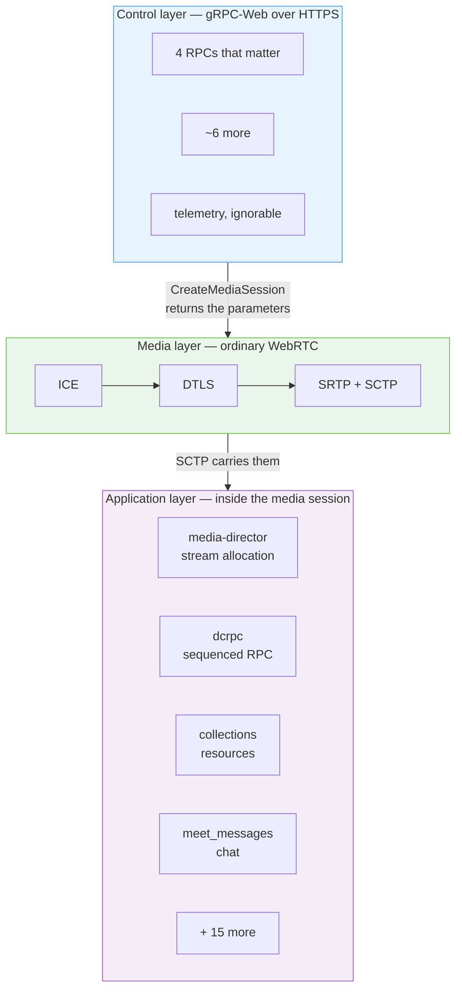
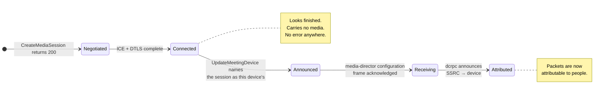
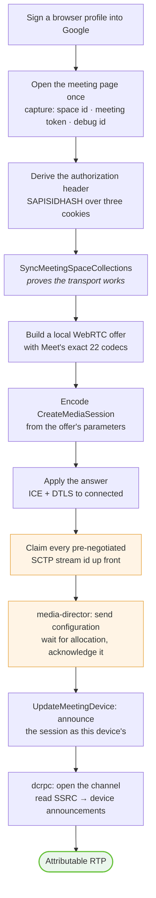

# 00 · Orientation

The mental model, before any bytes. Ten minutes here saves a week later.

---

## What Google Meet actually is, structurally

Strip away the product and Meet is three separate protocols stacked on each
other, each with its own encoding, its own authentication behaviour, and its own
failure vocabulary.



The instinct is to look for the API. There isn't one — there is a **thin** HTTP
API whose entire purpose is to hand you WebRTC parameters, and then a **rich**
message protocol that lives inside the WebRTC session you built from them.

Nearly everything a bot wants — who joined, who is speaking, what they said in
chat, which streams you are allowed to receive — is on the far side of a
completed DTLS handshake.

---

## The four things that surprise everyone

### 1. There is no WebSocket

The obvious guess for a real-time product. Meet does not use one. Signalling is
`POST https://meet.google.com/$rpc/<Service>/<Method>` — ordinary request and
response, with a **20-second long-poll** on `SyncMeetingSpaceCollections`
standing in for a push channel at the HTTP layer.

Real-time push happens over SCTP data channels instead, inside the media
session. → [Transport](01-transport.md)

### 2. SDP never crosses the wire

A WebRTC service that never exchanges SDP. Meet sends DTLS fingerprints, ICE
credentials, ICE candidates, codec parameters, and header extensions as
**structured protobuf fields**, and the browser assembles a session description
locally from them.

This is good news. A native client using a WebRTC library that takes structured
parameters can skip the assembly entirely, and one that needs SDP text can build
it deterministically. → [The media plane](10-media-plane.md)

### 3. The data channels are negotiated in an HTTP request

Not in an SDP `m=application` section, which is what every WebRTC tutorial would
lead you to expect. Thirteen channel labels are declared as repeated field
`1.3.17` of the `CreateMediaSession` request body, and the server answers with
the SCTP stream id it has assigned each one.

It then writes binary straight onto those streams, with no DCEP open message
ever sent. → [Data channels](06-data-channels.md)

### 4. Connecting is not joining, and joining is not receiving

Three distinct milestones that are easy to mistake for one another, because the
first two produce cheerful success logs and the third produces silence.



A client that stops at **Connected** has a perfectly healthy, entirely silent
session. This is the single most common way to lose a day.

---

## Who talks first, and about what

```mermaid
sequenceDiagram
    autonumber
    participant C as Client
    participant G as Google

    rect rgb(232, 244, 253)
    Note over C,G: Control plane — HTTPS, one call at a time
    C->>G: GET /&lt;meeting-code&gt;
    G-->>C: HTML carrying space id + token + debug id
    C->>G: SyncMeetingSpaceCollections
    G-->>C: meeting state · a fresher token in a response header
    C->>G: CreateMediaSession(offer parameters)
    G-->>C: answer parameters · ICE candidates · channel→stream table
    end

    rect rgb(234, 246, 236)
    Note over C,G: Media plane — one bundled transport
    C->>G: ICE binding, DTLS ClientHello
    G-->>C: DTLS server role, handshake completes
    end

    rect rgb(244, 236, 247)
    Note over C,G: Application layer — inside the session
    C->>G: media-director: resolutions I accept
    G-->>C: media-director: here is what I will send you
    C->>G: media-director: acknowledged
    C->>G: UpdateMeetingDevice: this session is mine
    G-->>C: dcrpc: these SSRCs belong to that device
    G-->>C: SRTP: packets, one track per participant
    end
```

Two things in that diagram are counter-intuitive enough to state outright:

- **The client opens the media-director conversation.** The server allocates
  nothing until asked. It is not waiting to push; it is waiting to be told what
  the client can handle.
- **`UpdateMeetingDevice` is load-bearing, not bookkeeping.** Until it lands, the
  server knows a media session exists but not that it belongs to a participating
  device. In a captured join it arrives immediately before the first allocation.

---

## Vocabulary

The terms are not interchangeable, and confusing two of them produces bugs that
pass length checks.

| Term | What it is | Looks like |
| --- | --- | --- |
| **Meeting code** | What a person types or clicks | `abc-defg-hij` |
| **Space id** | Google's opaque id for the conference | `EXAMPLEspace` |
| **Space name** | The resource form of the above | `spaces/EXAMPLEspace` |
| **Device** | One participant's one client instance | `spaces/<id>/devices/98` |
| **Media session** | One client's negotiated transport | `mediasessions/<28 chars>` |
| **Meeting token** | Rotating server-issued credential | `1785107358780;ADmEuv…` |
| **Debug id** | Per-page correlation id, required on the media call | `boq_hlane_<random>` |

> ⚠️ **A meeting code with its dashes and a space id are both twelve
> characters.** An implementation built on the wrong one passes every length
> check it will ever be given. `x-goog-meeting-identifier` carries the **space
> id**. This is the single cheapest mistake in the protocol to make and one of
> the more expensive to find. → [Failure modes](12-failure-modes.md)

---

## What a minimal client has to do

The shortest honest path from nothing to attributable audio.



Steps in amber are the ones with no error signal when skipped.

Roughly: four HTTPS calls, a WebRTC stack you did not write, and two protobuf
conversations. The media stack is off-the-shelf — **the work is the four RPCs,
not the media**.

---

## What this is not

- **Not an SDK.** No code here runs. It is a specification recovered from
  observation.
- **Not stable.** Google changes this whenever it likes, without notice, because
  nobody outside Google is supposed to be reading it.
- **Not complete.** [Open questions](14-open-questions.md) is an honest list, not
  a formality.
- **Not the official API.** The
  [Meet Media API](https://developers.google.com/meet/media-api) is supported,
  documented, and will not get an account banned. Prefer it when it fits.

---

**Next:** [01 · Transport](01-transport.md) — how a byte gets from your process
to Google's.
