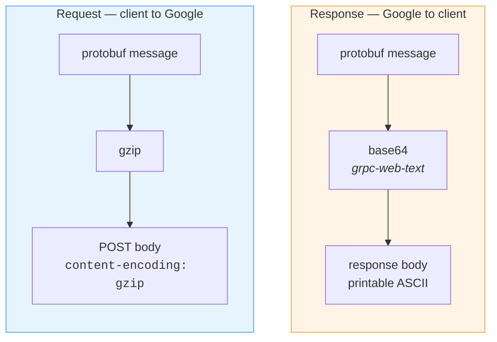

# 01 · Transport

How a byte gets from your process to Google's, and back.

---

## There is no WebSocket

✅ **Proven.** Signalling is gRPC-Web carried on ordinary HTTPS `POST`:

```
POST https://meet.google.com/$rpc/<fully.qualified.Service>/<Method>
```

Example:

```
POST https://meet.google.com/$rpc/google.rtc.meetings.v1.MeetingSpaceService/SyncMeetingSpaceCollections
```

One request, one response, connection reused. Real-time push does not happen
here — it happens on SCTP data channels inside the media session, which do not
exist until [`CreateMediaSession`](05-create-media-session.md) has succeeded.

The only push-like behaviour at the HTTP layer is a **long-poll**:
`SyncMeetingSpaceCollections` settles into an identical 75-byte request
returning an identical 72-byte response every 20 seconds, holding open until it
times out with nothing to report.

---

## The two directions use different encodings

This is the single most misleading thing about the wire format, and it costs
everyone a debugging round.



| Direction | Encoding | First bytes | Looks like |
| --- | --- | --- | --- |
| **Request** | gzip of raw protobuf | `1f 8b 08` | a gRPC frame header, misleadingly |
| **Response** | base64 of raw protobuf | `CiptZWRpYX…` | plain text, not protobuf at all |

Two consequences worth internalising:

- **A captured response is entirely printable ASCII.** Grepping the raw bytes
  for protobuf structure finds nothing. Decode once, then look.
- **A captured request begins with the gzip magic number.** `1f 8b 08` reads
  convincingly as a five-byte gRPC length prefix if that is what you are
  expecting.

Assuming symmetry is what makes these captures hard to read. Treat the two
directions as two codecs, not one codec with a flag.

### The frame prefix

✅ **Proven.** There is no five-byte gRPC length prefix in practice — a captured
`CreateMediaSession` request gunzips directly to a message whose first byte is a
protobuf tag.

Tolerating one on the response path costs a single branch and protects against a
server-side change, but strip it only when the declared length **agrees with
what follows**. A protobuf message can begin with bytes that read as a plausible
frame header, and stripping on shape alone silently eats five bytes of a real
message:

```
decoded[0]      flag byte
decoded[1..5]   big-endian u32 length
                strip iff length == decoded.len() - 5
```

---

## Body encoding varies by call

👁 **Observed.** The browser does not gzip everything. A 19-byte
`SyncMeetingSpaceCollections` body goes out uncompressed; a ~2.9 KB
`CreateMediaSession` body goes out gzipped.

✅ **Proven** that compression is *not* what `CreateMediaSession` was rejecting:
the accepted request was gzipped, and the same body sent plain was also
accepted once the token scope and debug id were right. Encode either way; do not
spend a round trip on it.

---

## Anatomy of a request

```
POST /$rpc/google.rtc.meetings.v1.MediaSessionService/CreateMediaSession HTTP/2
Host: meet.google.com

authorization:              SAPISIDHASH … SAPISID1PHASH … SAPISID3PHASH …
cookie:                     SAPISID=…; __Secure-1PAPISID=…; __Secure-3PAPISID=…
origin:                     https://meet.google.com          ← required
referer:                    https://meet.google.com/
content-type:               application/x-protobuf
content-encoding:           gzip
x-goog-api-key:             AIzaSy…                          ← public
x-goog-authuser:            0
x-goog-meeting-identifier:  CAMSDEVYQU1QTEVzcGFjZQ==         ← base64 protobuf, space id
x-goog-meeting-token:       1785107358780;ADmEuv…            ← server-issued, scoped
x-goog-meeting-rtcclient:   CAEQqgMYASABKAg4AQ==             ← client descriptor
x-goog-meeting-debugid:     boq_hlane_…                      ← required on the media call
x-goog-encode-response-if-executable: base64

<gzip of protobuf>
```

Full table with provenance and required/optional status:
**[reference/headers.md](../reference/headers.md)**.

Two that behave surprisingly:

- **`origin` is not optional.** The authorization signature is computed *over*
  the origin and the server checks the two agree. Omitting it produces
  `401 missing required authentication credential`, which points misleadingly at
  the cookies. → [Authentication](02-authentication.md)
- **`x-goog-meeting-bot-info` is optional.** ✅ **Proven** — it appeared on 4 of
  373 captured RPCs, all `UpdateMeetingDevice`, and every critical-path request
  had zero. A from-scratch client omitting it gets `200`. Its prefix decodes to
  plain protobuf, field 3, 2446 bytes — not a signature.

---

## The user agent matters

🧩 **Inferred, acted on.** Google serves different code and different documents
to clients it does not recognise as a browser. A client borrowing a browser
profile's session should send that browser's product token:

```
Mozilla/5.0 (Macintosh; Intel Mac OS X 10_15_7) AppleWebKit/537.36 (KHTML, like Gecko) Chrome/150.0.0.0 Safari/537.36
```

This matters most on the **page fetch**, not the RPCs: fetching
`meet.google.com/<code>` with cookies and a Chrome user-agent returns `200` and
an HTML document **with no space id in it**, while the real browser's document —
2.28 MB — contains it. The difference is the rest of the fingerprint
(`sec-ch-ua`, `sec-fetch-*`, client hints). ❓ **Unknown** which specifically;
bounded problem, not a wall. → [Open questions](14-open-questions.md)

---

## Reading a refusal

The body of a failed `$rpc` call is a `google.rpc.Status`, not text.

Read as a string it reduces to one sentence — *"Request contains an invalid
argument."* — which is the same sentence for every possible cause. Read as
protobuf it can carry `BadRequest.FieldViolation` entries that name the
offending field outright.

```
Status
  1  varint    code
  2  string    message          ← the useless sentence
  3  Any       details
       1  string   "type.googleapis.com/google.rpc.BadRequest"
       2  BadRequest
            1  FieldViolation
                 1  string  field        ← "media_session.ice.ufrag"
                 2  string  description  ← "must not be empty"
```

Two practical notes:

- **Walk, don't index.** The details are `Any`-wrapped, so their depth depends
  on which detail type Google chose. A fixed path finds nothing the moment that
  changes. Six levels of recursion covers everything observed.
- **A pair of adjacent strings is not a violation.** Any two string fields decode
  as a plausible `(field, description)` pair, so a naive walk reports every label
  in the reply. Require the first to look like a field path (alphanumerics,
  `. _ [ ] -`) and the second to look like a sentence (contains a space, no
  control bytes).

### The status codes you will actually see

| HTTP | Meaning here | Usual cause |
| --- | --- | --- |
| `200` | Accepted | — |
| `400` | *"This RPC requires a meeting token but nothing was provided."* | header absent |
| `400` | *"Request contains an invalid argument."* | malformed body **or wrong token scope** — indistinguishable |
| `401` | *"missing required authentication credential"* | `origin` not sent, or cookies wrong |
| `403` | *"The caller does not have permission"* | acting on someone else's device |
| `404` | Method not found | wrong service prefix — see below |

> **Diagnostic worth knowing:** `400` and `404` distinguish *"a body Google
> disliked"* from *"a method Google has never heard of."* If a service name is
> inferred rather than captured, call a method that certainly does not exist and
> compare the two responses. This is the cheapest experiment in the protocol and
> it settles service-name questions in one round trip.

---

## The telemetry you can ignore

`ExternalSupportDataWriterService/WriteConferenceSessionLog` and
`play.google.com/log` account for 140+ calls per minute and carry no meaning for
a client. 👁 **Observed** — omitted entirely by a from-scratch client with no
consequence.

---

**Next:** [02 · Authentication](02-authentication.md) — three signatures, two
token caches, one origin.
