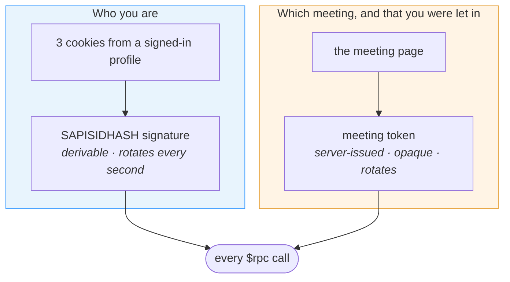
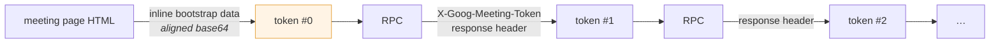
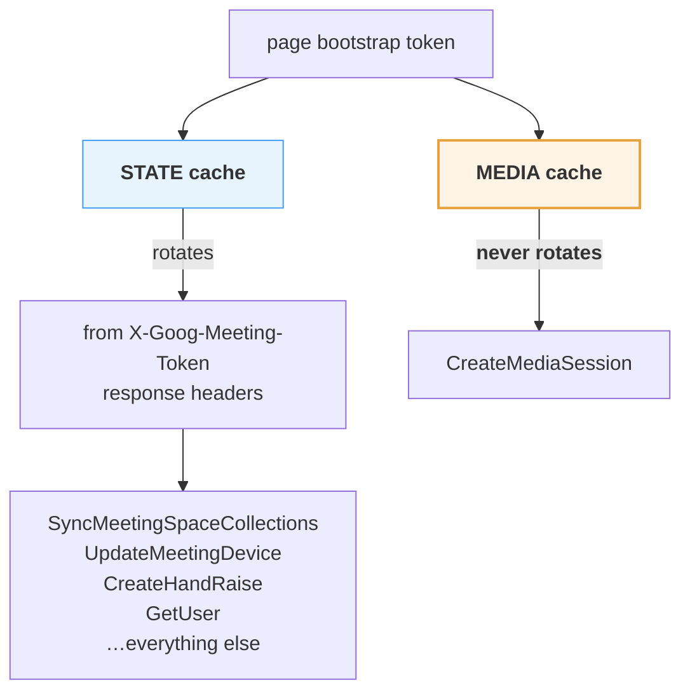
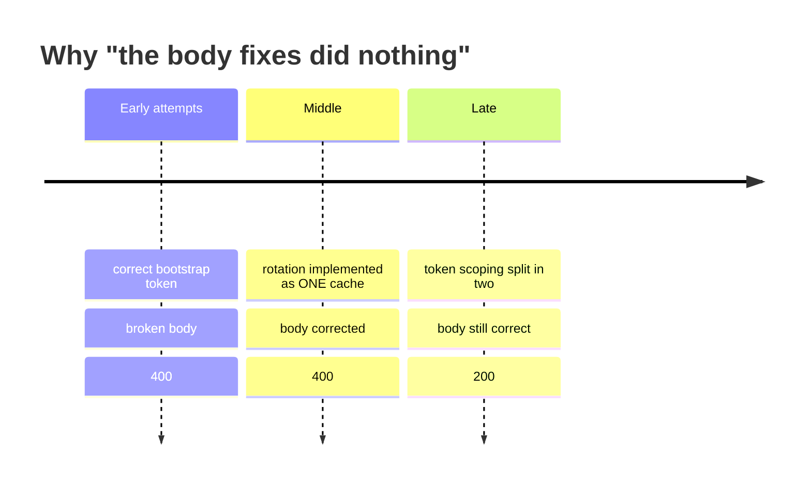

# 02 · Authentication

Three signatures derived from cookies, and two token caches that must never be
merged.

There is **no OAuth here, and no token exchange**. Meet authenticates the way
Google's first-party web properties do: a signature over cookies the browser
already holds.

---

## The two credentials, and what each proves



The first is fully derivable from a cookie jar — that is what makes a native
client possible at all. The second is not, and is the reason a browser is still
needed once per meeting.

---

## Part 1 · The authorization header

✅ **Proven.** Derived from cookies in a from-scratch client; produces HTTP 200.

The header carries **three labelled signatures**, not one:

```
authorization: SAPISIDHASH <ts>_<sha1>  SAPISID1PHASH <ts>_<sha1>  SAPISID3PHASH <ts>_<sha1>
```

| Label | Cookie | Why it exists |
| --- | --- | --- |
| `SAPISIDHASH` | `SAPISID` | the original |
| `SAPISID1PHASH` | `__Secure-1PAPISID` | first-party partitioned context |
| `SAPISID3PHASH` | `__Secure-3PAPISID` | third-party partitioned context |

Each signature is:

```
<unix seconds> "_" sha1( <unix seconds> + " " + <cookie value> + " " + <origin> )
```

with the sha1 rendered as lowercase hex, and

```
origin = "https://meet.google.com"
```

### Pseudocode

```
def authorization(cookies, now_seconds):
    parts = []
    for label, cookie in [("SAPISIDHASH",   cookies.SAPISID),
                          ("SAPISID1PHASH", cookies["__Secure-1PAPISID"]),
                          ("SAPISID3PHASH", cookies["__Secure-3PAPISID"])]:
        digest = sha1(f"{now_seconds} {cookie} https://meet.google.com").hexdigest()
        parts.append(f"{label} {now_seconds}_{digest}")
    return " ".join(parts)
```

### The length check that catches a wrong inference

The scheme was 🧩 **inferred** from an observed header of **exactly 195
characters**, which is precisely three labelled signatures at a 10-digit
timestamp:

```
  11 + 1 + 10 + 1 + 40   SAPISIDHASH    = 63
+  1 + 13 + 1 + 10 + 1 + 40   SAPISID1PHASH  = 66
+  1 + 13 + 1 + 10 + 1 + 40   SAPISID3PHASH  = 66
                                        ─────
                                          195
```

Worth pinning in a test. If the inference is ever wrong, a length assertion
fails loudly at build time instead of producing rejected requests at runtime.

### `origin` must be sent

✅ **Proven, and non-obvious.** The signature is computed over the origin and the
server checks the two agree. Hashing an origin without sending it produces a
signature the server cannot verify, and it reports that as:

```
401  missing required authentication credential
```

which points at the cookies. It is not the cookies. Send
`Origin: https://meet.google.com`.

### Signatures expire

Timestamped, therefore replayable only briefly. A captured `authorization`
header stops working within the hour — which is precisely why deriving it
matters rather than copying one.

---

## Part 2 · The meeting token

```
x-goog-meeting-token: 1785107358780;ADmEuv……
                      └─epoch ms──┘ └──opaque──┘
```

Required on **every** RPC. Omitting it:

```
400  "This RPC requires a meeting token but nothing was provided."
```

| Property | Value | Evidence |
| --- | --- | --- |
| Format | `<epoch milliseconds>;<opaque>` | ✅ Proven |
| Opaque part | begins `ADmEuv`, unpadded base64url | 👁 Observed |
| Observed lengths | 247, 261, 268, 282, 290, 304 chars | 👁 Observed |
| Origin | **server-issued**, not client-generated | ✅ Proven |
| Distinct values per session | 5–7 | 👁 Observed |
| Minting algorithm | opaque | ❓ Unknown |

### Where it comes from



- The **first** token is embedded in the page's inline bootstrap data as
  **aligned base64** — which is why searching the HTML for it as plain text finds
  nothing. This was, for a long time, taken as evidence that the browser
  generated it. It does not.
- Every **later** token arrives in an `X-Goog-Meeting-Token` **response header**,
  most often on `SyncMeetingSpaceCollections`.

### The rotation rule

Meet's own transport keeps one cached, attaches it to each request, and replaces
it only when a response carries a **strictly newer embedded epoch**. Values that
are not newer are ignored.

```
def maybe_rotate(held, from_response):
    if from_response.epoch_ms > held.epoch_ms:
        held = from_response       # strictly newer only
```

Strictly, not `>=`: accepting an equal-or-older token lets a slow response put
back the value it was issued alongside, overwriting a fresh one.

A client that keeps its first token is signing requests with a value the server
has already superseded.

---

## Part 3 · Two caches, not one

> ✅ **Proven, and the most expensive single fact in this document.**

Meet does **not** keep one newest meeting token. It keeps **two**, scoped by
transport, and they diverge within seconds of a page loading.



| Scope | Seeded from | Rotates? | Observed lengths |
| --- | --- | --- | --- |
| **State** — meeting, device, sync | page bootstrap | **yes**, from response headers | 282, 304 |
| **Media** — `CreateMediaSession` | page bootstrap | **no**. No media token has ever been seen on a response. | 261 |

**Signing the media call with the rotated state token is refused as
`400 invalid argument`** — the same words Meet uses for a malformed body. The
failure therefore reads as a protobuf problem and sends you looking in the wrong
place for a long time.

### Why this was so hard to see

The damage was hidden by timing, and the shape of it is worth remembering
because it generalises:



The token was right while the body was wrong, then the body was right while the
token was wrong, and the two were never right together — which reads from the
outside as *"the body fixes did nothing."*

Two lessons, the second more expensive than the first:

1. A finding about **what** a value is does not tell you **how many** of it there
   are. "The token is server-issued and rotates" was entirely correct and still
   produced a broken client when implemented as one cache.
2. **Changing two things between runs destroys the run.** The body corrections
   and the token rotation went in together.

### Implementation guidance

Put the scope choice **in the transport, not in the caller**. It is a property
of the service:

```
scope(service) = MEDIA  if service ends with "MediaSessionService"
                 STATE  otherwise
```

A caller has no way to tell the two failure modes apart, so making it an
argument only creates a way to get it wrong.

**Diagnostic:** log the two cached token *lengths*. Bootstrap values run 261
characters and rotated state values 282 or 304, so **equal lengths in a log mean
the scoping has collapsed back into one cache**.

---

## Part 4 · The other headers that carry identity

### `x-goog-meeting-identifier` — required

✅ **Proven.** Base64 of a two-field protobuf carrying the **space id**:

```
{ 1: 3, 2: "<space id>" }        →  base64  →  "CAMSDEVYQU1QTEVzcGFjZQ=="
```

Field 1 is `3` in every capture; its meaning is ❓ **unknown**, so reproduce it
rather than reason about it.

This header is also the **only place the space id appears before a join
completes**. The pre-join screen never writes `spaces/<id>` into the document,
but it does send this header on its first RPC — so decoding it back out is what
makes a token-only visit possible: open the meeting, capture the header and
token, close the browser, never become a participant.

> ⚠️ It carries the **space id**, not the meeting code. Both are twelve
> characters, so both encode to a 24-character header value and a length check
> cannot tell them apart. Pin the actual bytes in a test, not the length.

### `x-goog-meeting-debugid` — required on the media call

✅ **Proven required**, and it had been recorded as optional telemetry. It is
not. With the media token correct and this header absent, `CreateMediaSession`
is still refused:

```
gzip · 261-char media token · no debug id    →  400 invalid argument
gzip · 261-char media token · with debug id  →  200, 5222-byte answer
```

Two runs three minutes apart, differing in nothing else.

The value is the page's own correlation id (`boq_hlane_<random>`), captured from
the browser's own `CreateMediaSession` alongside the token it was sent with —
**the two belong to the same request**.

### `x-goog-meeting-rtcclient` — client descriptor

👁 **Observed**, byte-identical across every captured request:

```
CAEQqgMYASABKAg4AQ==   →   { 1: 1, 2: 426, 3: 1, 4: 1, 5: 8, 7: 1 }
```

A version and a set of capability flags. **The same bytes also ride inside every
`dcrpc` request body** at field `7` of the client identity block — so getting
one right and the other wrong is possible, and produces no distinct symptom.
→ [dcrpc](08-dcrpc.md)

### `x-goog-api-key` — a browser key, not redacted here for its own sake

```
AIzaSy…    (39 characters — read it out of Meet's own bundle)
```

Public by construction: it ships in Meet's JavaScript and identifies the
*application*, not the user. It is not a credential and it grants nothing on its
own.

**It is written elided anyway.** A string matching `AIzaSy[0-9A-Za-z_-]{33}` in a
public repository is treated as a leaked secret by GitHub's scanner, by Google's,
and by every SAST tool in between — regardless of what it actually is. Publishing
it verbatim generates real alerts and can get a key someone else depends on
revoked.

The protocol fact is *"this header carries a public browser API key, obtainable
from the page's own bundle,"* and that fact survives elision intact. To get the
current value, open `meet.google.com` with devtools and read `x-goog-api-key` off
any `$rpc` request.

The same reasoning applies to the meeting-token examples in this document: the
epoch is shown in full because it is structural, and the opaque part is cut after
`ADmEuv` because it is not.

### `x-goog-meeting-bot-info` — omit it

✅ **Proven optional.** Present on 4 of 373 captured RPCs, all
`UpdateMeetingDevice` — and even that call omitted it 18 times out of 22. Every
critical-path request had zero. A from-scratch client omitting it entirely gets
`200`.

Worth stating because it is 3268 bytes and looks exactly like client
attestation, which made it the most plausible candidate for "the thing that will
block a native client." It is not. Its prefix decodes to plain protobuf, field
3, 2446 bytes.

---

## What a native client can and cannot derive

| Value | Source | Derivable without a browser? |
| --- | --- | --- |
| `authorization` | SAPISIDHASH over cookies | ✅ yes |
| `cookie` | signed-in profile | ✅ yes, from a profile |
| `x-goog-meeting-identifier` | constructed from the space id | ✅ yes, *given the space id* |
| `x-goog-api-key` | public constant | ✅ yes |
| `x-goog-meeting-rtcclient` | constant | ✅ yes |
| `x-goog-meeting-bot-info` | — | ✅ omit it |
| **space id** | page HTML / first RPC's header | ❌ needs a browser fingerprint |
| **meeting token** | page bootstrap, then response headers | ❌ **no minting algorithm known** |
| **debug id** | page | ❌ borrowed |

Three values, one page load. That is the entire remaining browser dependency,
and the browser can be closed before the first native call is made — which is
worth doing deliberately, because a call that only worked while the page was
alive would be indistinguishable from one that genuinely worked.

---

## Anonymous access is refused

✅ **Proven.** A fresh, signed-out browser profile is turned away outright:

> *"You can't join this video call — no one can join a meeting unless invited or
> admitted by the host."*

Not a lobby. Not a timeout. Signing in is a prerequisite, not a convenience, and
there is no protocol-level path around it.

---

**Next:** [03 · The join sequence](03-join-sequence.md) — the four calls, in
order, with what each one yields.
