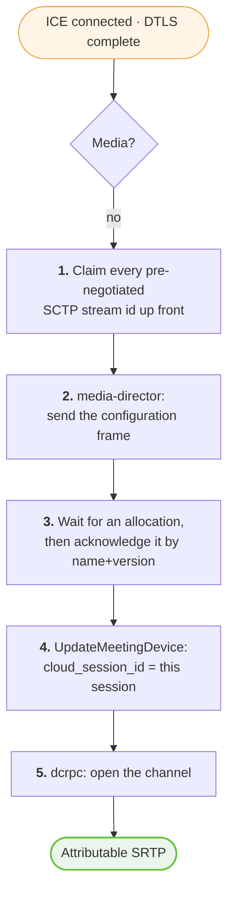
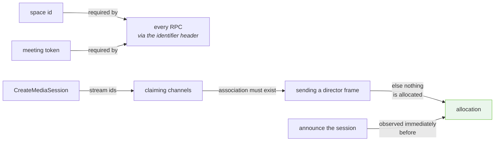

# 03 · The join sequence

Four calls, in order, with what each one yields and what breaks if it is
skipped.

---

## The chain

| # | Step | Yields | Evidence |
| --- | --- | --- | --- |
| 0 | `GET meet.google.com/<code>` | space id, meeting token, debug id | ✅ via browser |
| 1 | `SyncMeetingSpaceCollections` | meeting state; a fresher token | ✅ Proven |
| 2 | `UpdateMeetingDevice` | device state | ✅ Proven |
| 3 | `CreateMediaSession` | DTLS, ICE, codecs, channel→stream table | ✅ Proven |

Steps 1–3 are reproducible from a from-scratch client with **no browser
running**. Step 0 is not. → [Open questions](14-open-questions.md)

---

## Full sequence, with the media session

```mermaid
sequenceDiagram
    autonumber
    participant B as Browser<br/>(once)
    participant N as Native client
    participant G as Google
    participant P as Peer transport

    rect rgb(255, 244, 229)
    Note over B,G: Step 0 — bootstrap. The only browser dependency.
    B->>G: GET /&lt;meeting-code&gt;
    G-->>B: 2.3 MB HTML
    Note right of B: extract: spaces/&lt;id&gt;<br/>meeting token (aligned base64)<br/>debug id
    B->>B: close
    end

    rect rgb(232, 244, 253)
    Note over N,G: Step 1 — prove the transport
    N->>G: SyncMeetingSpaceCollections { 1: "spaces/&lt;id&gt;" }
    Note left of N: 19-byte body.<br/>The whole request is the space name.
    G-->>N: meeting state
    G-->>N: X-Goog-Meeting-Token: &lt;newer&gt;
    Note right of N: rotate STATE cache only
    end

    rect rgb(232, 244, 253)
    Note over N,G: Step 2 — device state
    N->>G: UpdateMeetingDevice { device, audio_state } + field mask
    G-->>N: 200
    end

    rect rgb(234, 246, 236)
    Note over N,P: Step 3 — negotiate media
    N->>N: build local offer with Meet's exact 22 codecs
    N->>G: CreateMediaSession(~2.9 KB: DTLS, ICE, codecs, extensions, 13 channels)
    Note right of N: MEDIA token · debug id required
    G-->>N: ~5.2 KB: answer params, 4 candidates, 22 codecs,<br/>channel → SCTP stream table
    N->>N: assemble the answer locally
    N->>P: ICE, then DTLS as client
    P-->>N: connected
    end

    rect rgb(244, 236, 247)
    Note over N,P: Step 4 — the part that is not in the HTTP API
    N->>P: claim all 13 pre-negotiated stream ids
    N->>P: media-director: configuration
    P-->>N: media-director: allocation
    N->>P: media-director: acknowledgement
    N->>G: UpdateMeetingDevice: cloud_session_id = this session
    N->>P: dcrpc: open (kind 2, then kind 1)
    P-->>N: dcrpc: acknowledged
    P-->>N: dcrpc: SSRC → device announcements
    P-->>N: SRTP packets
    end
```

---

## Step 0 · Bootstrap

**What it yields:** three strings, all of which must come from a real browser
today.

```
spaces/<id>            somewhere in ~2.3 MB of HTML
<epoch>;ADmEuv…        inline bootstrap data, aligned base64
boq_hlane_<random>     the page's debug correlation id
```

**Why a plain fetch does not work.** ✅ **Proven failure:** fetching the page
with the profile's cookies and a Chrome user-agent returns `200 OK` and HTML
**with no space id in it**. Google serves a different document to a client
lacking a full browser fingerprint. The likely fix is `sec-ch-ua`, `sec-fetch-*`
and the rest of the client hints; ❓ untested.

**The shortcut worth knowing.** The pre-join screen never writes `spaces/<id>`
into the document — that appears only once the browser has *joined*. But it
does send `x-goog-meeting-identifier` on its first RPC, and that header decodes
straight back to the space id. So the browser can open the meeting, hand over a
token and an identifier, and **never become a participant**.

> ⚠️ When scanning HTML for the space id, scan the **whole document**, not just
> `<script>` tags. A partial scan finds a *stale* space id from a
> recent-meetings list and stops the search. A partial scan that finds something
> plausible is worse than one that finds nothing.

---

## Step 1 · SyncMeetingSpaceCollections

```
POST /$rpc/google.rtc.meetings.v1.MeetingSpaceService/SyncMeetingSpaceCollections
```

The entire request body:

```
1  string  "spaces/<id>"
```

Nineteen bytes on the wire for a twelve-character space id. This is the smallest
call in the protocol and therefore the right one to prove a transport with —
if the headers are wrong, they are wrong here, with no body to blame.

**It doubles as a long-poll.** After the initial burst it settles into an
identical 75-byte request returning an identical 72-byte response every 20
seconds — a poll timing out with nothing to report.

**It is also the main token source.** Later meeting tokens arrive on this call's
response headers more often than on any other.

### What it returns

Meeting and participant state. 👁 **Observed** to carry the roster, but note the
subscription behaviour described in
[collections and actions](09-collections-and-actions.md): **Meet pushes only
what a client subscribes to.** A client that opens no panels sees very little
here and on `collections`, and that silence is not evidence of an empty
protocol.

---

## Step 2 · UpdateMeetingDevice

```
POST /$rpc/google.rtc.meetings.v1.MeetingDeviceService/UpdateMeetingDevice
```

A field-masked update. The smallest useful form:

```
1  device       { 1: "spaces/<id>/devices/<n>", 14: { 2: <audio state> } }
2  update_mask  { 1: "audio_state" }
```

**Which device is ours?** The roster does not say. It does not need to: Meet
answers `403 The caller does not have permission` for someone else's device and
`200` for our own, so **trying each device in turn is self-correcting**. 👁
Observed.

**Why this call is worth making early.** It is the smallest *write* in the
protocol. Reads succeeding while `CreateMediaSession` fails tells you nothing;
a **write** succeeding at the same moment tells you the credential is fine and
the problem is the media call specifically. That single experiment is what
localised the token-scope bug — writes are state-scoped, and the state token was
correct all along.

---

## Step 3 · CreateMediaSession

```
POST /$rpc/google.rtc.meetings.v1.MediaSessionService/CreateMediaSession
```

The big one: ~2.9 KB decompressed, ~5.2 KB answer. Everything about it is in
[05 · CreateMediaSession](05-create-media-session.md).

Three preconditions that each produce the identical `400 invalid argument`:

1. the **media**-scoped token, not the rotated state one
2. `x-goog-meeting-debugid` present
3. a body whose field numbers, nesting, and session-id shape all match

> The service name `google.rtc.meetings.v1.MediaSessionService` is 🧩
> **inferred** — the capture recorded it by short name only, and the proven
> sibling is `google.rtc.meetings.v1.MeetingSpaceService`. A wrong prefix returns
> `404`, not `400`, so this is cheap to verify.

---

## Step 4 · The part that is not in the HTTP API

At the end of step 3 the peer connection reports `connected` and **no media
arrives**. This is not a failure state and nothing logs an error.



Each step and its wire format:

- 1 → [Data channels](06-data-channels.md)
- 2, 3 → [media-director](07-media-director.md)
- 4 → below
- 5 → [dcrpc](08-dcrpc.md)

### Announcing the session — the second `UpdateMeetingDevice`

✅ **Proven accepted.** In a captured join this lands immediately before the
first stream allocation. Until it arrives, Meet knows a media session exists but
not that it belongs to a *participating device*.

```
1  device {
     1:  "spaces/<space>/devices/<n>"
     4:  1
     22: "<session id WITHOUT the mediasessions/ prefix>"
     25: 1
     38: 1
   }
2  update_mask {
     1: "cloud_session_id"
     1: "join_state"
     1: "media_capture_type"
     1: "participation_mode"
   }
```

Note field `22`: the session id **bare**, where `CreateMediaSession` names it
with its `mediasessions/` prefix. The same id, written two ways, in two calls
that sit seconds apart. → [dcrpc](08-dcrpc.md) writes it bare as well.

---

## Ordering constraints

Not everything is order-dependent. These are:



**The one that bites:** a frame cannot be written before the SCTP association
exists. Sending on a locally-opened channel too early fails with
`data channel not existed` — a **stack warning, not an error the caller sees** —
and costs the one frame that makes Meet allocate anything.

Meanwhile a channel Meet hands over is *already open* when it is handed over, so
its open event has already been and gone. Waiting for that event before sending
is waiting forever.

Both paths are therefore needed: **send now if the channel is ready, and again
on open if it was not.**

---

**Next:** [04 · RPC catalogue](04-rpc-catalogue.md) — every service and method
observed.
