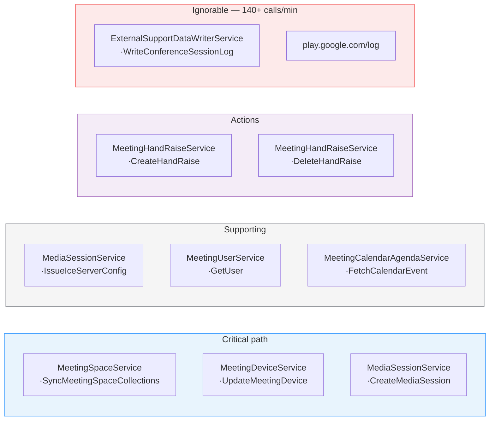
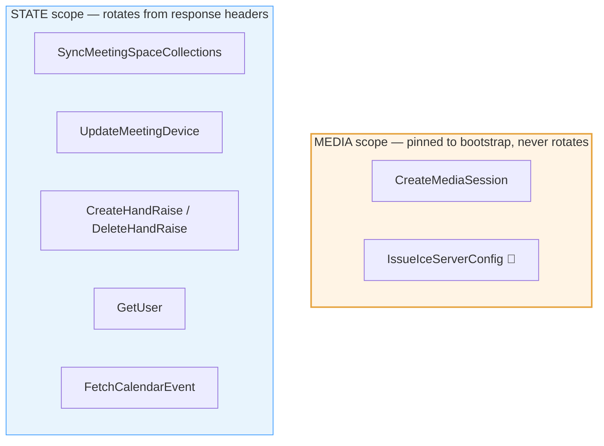

# 04 · RPC catalogue

Every service and method observed, what it is for, and how sure we are of the
name.

All are `POST https://meet.google.com/$rpc/<Service>/<Method>`.

---

## The map



---

## Catalogue

| Service · Method | Role | Token scope | Evidence |
| --- | --- | --- | --- |
| `MeetingSpaceService/SyncMeetingSpaceCollections` | meeting + participant state; **20s long-poll**; main token source | State | ✅ Proven, full name captured |
| `MediaSessionService/CreateMediaSession` | media negotiation | **Media** | ✅ Proven; 🧩 service prefix inferred |
| `MediaSessionService/IssueIceServerConfig` | STUN/TURN credentials; **empty request body** | Media 🧩 | 👁 Observed |
| `MeetingDeviceService/UpdateMeetingDevice` | device state, field-masked | State | ✅ Proven |
| `MeetingHandRaiseService/CreateHandRaise` | raise a hand | State | 👁 Observed |
| `MeetingHandRaiseService/DeleteHandRaise` | lower a hand | State | 👁 Observed |
| `MeetingUserService/GetUser` | account details | State | 👁 Observed |
| `MeetingCalendarAgendaService/FetchCalendarEvent` | title, times, invitees | State | 👁 Observed, body undecoded |
| `ExternalSupportDataWriterService/WriteConferenceSessionLog` | telemetry | — | ignore |

The fully-qualified prefix observed is `google.rtc.meetings.v1.` — so the first
row is, in full:

```
google.rtc.meetings.v1.MeetingSpaceService/SyncMeetingSpaceCollections
```

> **Verifying an inferred service name costs one round trip.** A wrong prefix
> returns `404`; a wrong body returns `400`. Ask for a method that certainly
> does not exist and compare the two. This is the cheapest experiment in the
> protocol.

---

## Bodies

### `SyncMeetingSpaceCollections` ✅

Request, in its entirety:

```
1  string  "spaces/<id>"
```

Response: meeting state, gated by subscription
(→ [collections](09-collections-and-actions.md)). In the steady-state long-poll,
75 bytes in and 72 bytes out, every 20 seconds, unchanging.

### `UpdateMeetingDevice` ✅

Field-masked. Two observed shapes:

**Audio state:**
```
1  device       { 1: "spaces/<id>/devices/<n>", 14: { 2: <state> } }
2  update_mask  { 1: "audio_state" }
```

**Announcing the media session** — this is the load-bearing one:
```
1  device {
     1:  "spaces/<space>/devices/<n>"
     4:  1
     22: "<session id, bare — no mediasessions/ prefix>"
     25: 1
     38: 1
   }
2  update_mask { 1: "cloud_session_id"
                 1: "join_state"
                 1: "media_capture_type"
                 1: "participation_mode" }
```

Field numbers → names, from the mask ordering: 🧩 **inferred** that `22` is
`cloud_session_id`, `4` or `25` is `join_state`, and the rest follow. The mask
strings are ✅ observed verbatim.

**Permission behaviour:** `403 The caller does not have permission` for another
participant's device, `200` for your own. Use it as a probe.

### `CreateMediaSession` ✅

~2.9 KB. Its own document: [05 · CreateMediaSession](05-create-media-session.md).

### `IssueIceServerConfig` 👁

**Empty request body.** Returns Google STUN and TURN servers with credentials.

Worth knowing: the browser constructs its `RTCPeerConnection` with an **empty
`iceServers` list** and applies these afterwards via `setConfiguration`. A
native client can do the same, or skip it — the media session's own candidates
were sufficient to reach `connected` in testing.

### `CreateHandRaise` / `DeleteHandRaise` 👁

The raise/lower pair. Creates and deletes a `spaces/<id>/handRaises/<n>`
resource, which then shows up on the `collections` data channel.

Notable as the **only user-visible action confirmed to travel over HTTP** rather
than a data channel. → [Actions](09-collections-and-actions.md)

### `GetUser` 👁 · `FetchCalendarEvent` 👁

`GetUser` returns account details. `FetchCalendarEvent` returns title, times and
invitees — 👁 observed present, body ❓ undecoded, and it is **the most plausible
route to participant email addresses**, which appear nowhere else in any
capture. → [Capabilities](11-capabilities.md)

---

## Which calls each token scope covers



Rule of thumb, and how a client should implement it: **service name ends with
`MediaSessionService` → media token; otherwise state token.**
→ [Authentication](02-authentication.md)

---

## What is *not* an RPC

Worth an explicit list, because three separate investigations went looking for
these in HTTP traffic and found nothing:

| Action | Actually travels on |
| --- | --- |
| Send a chat message | `meet_messages` data channel |
| Receive chat, roster, hand raises | `collections` data channel |
| Mute / unmute, camera on/off | `dcrpc` data channel |
| Request which participants to receive | `media-director` data channel |
| Learn which SSRC belongs to whom | `dcrpc` data channel |

**There are zero data-channel *sends* on `collections` in any capture.** It is
receive-only from the client's point of view; outbound actions never travel that
way.

The action surface is genuinely **split across three transports**, and no single
mechanism covers it. → [Actions](09-collections-and-actions.md)

---

**Next:** [05 · CreateMediaSession](05-create-media-session.md) — the 2.9 KB
message, field by field.
