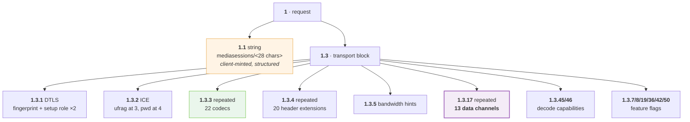
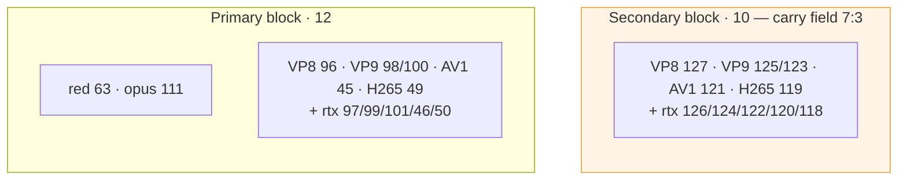
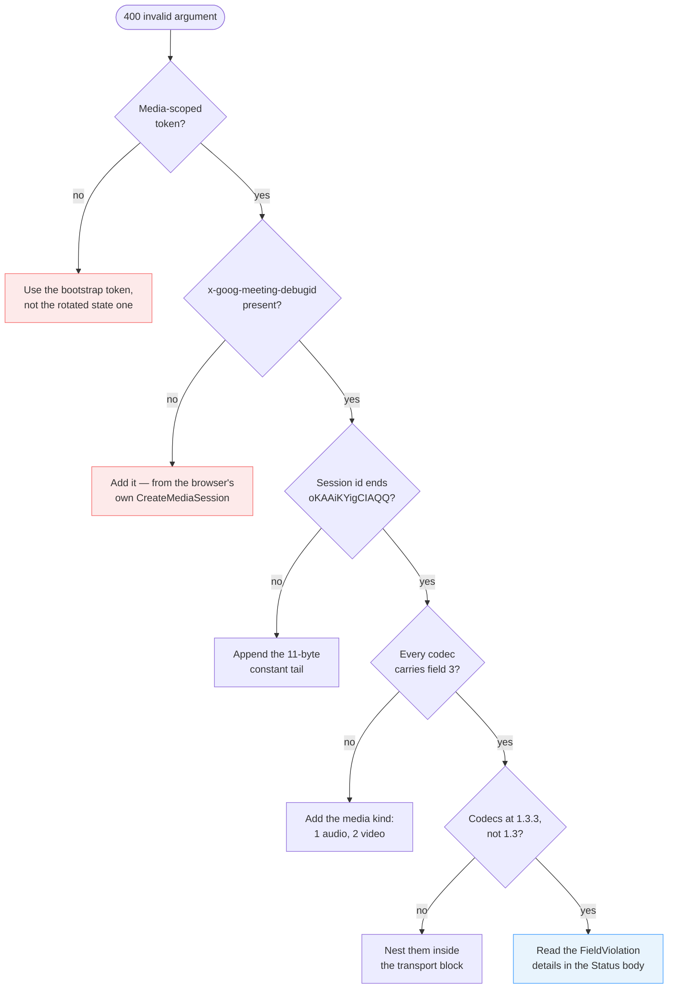

# 05 · CreateMediaSession

The message that turns an HTTP session into a WebRTC one. ~2.9 KB out, ~5.2 KB
back, and every field below was read off a capture rather than guessed.

That distinction matters more here than anywhere else in the protocol, because
**Meet validates the whole message and answers `400 invalid argument` with no
indication of which field it disliked.** A guess costs a round trip and teaches
you nothing.

---

## Shape



Twenty captures, **all 2893 bytes decompressed**, differing only in the fields
that vary per session. That consistency is what makes the field map trustworthy:
anything that did not vary across twenty sessions is a constant, and anything
that did is a parameter.

> **Nothing in this message names the meeting.** The space travels in the
> `x-goog-meeting-identifier` header. A request body that looks complete and
> mentions no conference is correct.

---

## Request, field by field

```
1                message   request
1.1              string    "mediasessions/<28 chars>"    client-minted; see below
1.3                        transport block
1.3.1                      DTLS
1.3.1.1          message   { 1: "sha-256", 2: <fingerprint> }
1.3.1.2          varint    3        ← setup role. THREE, not one.
1.3.1.3          varint    3        ← the same value again
1.3.2                      ICE
1.3.2.3          string    ice-ufrag   (4 chars)
1.3.2.4          string    ice-pwd     (24 chars)
1.3.3            repeated  codec {
                             1: payload type
                             2: name              "opus", "VP8", "rtx", …
                             3: MEDIA KIND        1 = audio, 2 = video
                             4: clock rate
                             5: channels
                             6: repeated fmtp { 1: key, 2: value }
                             7: 3   — second block only
                             8: { 1: mode }        video only
                             9: { 1: layered }     video only
                           }
1.3.4            repeated  header extension { 1: id, 2: uri, 3: kind, 4: flag }
1.3.5            message   { 2: 6500, 3: 500 }          bandwidth hints
1.3.7            message   { 1: 4 }
1.3.8            message   { 1: 1, 2: 2 }
1.3.17           repeated  channel { 1: label, 2: 0, 4: 1, 7: <opaque bytes> }
1.3.19           message   { 1: 2 }
1.3.36           varint    2
1.3.42           varint    1
1.3.45           message   { 1: 4, 2: 4, 4: 10, 6: <GPU renderer string> }
1.3.46.1         message   { 1..16: capability flags; 5 and 6 = 2073600 }
1.3.50           varint    1
```

Field `2` of the root message is unused in every capture.

---

## The five fields that get people

### 1 · `1.3.3.3` is the media kind, not a second clock rate

Its position between the codec name and the clock rate reads exactly like a
second rate. It is `1` for audio and `2` for video, it appears on **every**
codec, and **omitting it is on its own enough to have the whole request
refused**.

```
   1: 111          payload type
   2: "opus"       name
   3: 1            ← media kind. Reads like a rate. Is not.
   4: 48000        clock rate
   5: 2            channels
```

An early field map here recorded `"3, 4: clock rate"` — two fields for one
value — and that misreading survived several rounds because the encoder it
produced was internally consistent.

### 2 · The setup role is `3`, not `1`

🧩 The value was guessed at `1` on the reasoning that `actpass` is the first of
three roles. 👁 The capture says `3`, in both `1.3.1.2` and `1.3.1.3`. Meet
rejects the entire request rather than naming the field.

### 3 · ICE credentials sit at fields **3 and 4**, not 1 and 2

The low numbers carry something the capture never populated. Writing the
credentials at `1` and `2` produces a message that encodes perfectly and
describes no usable transport.

Also: Meet has only ever been shown a **4-character ufrag and a 24-character
password**. RFC 5245 permits far wider ranges and most WebRTC stacks default to
16 and 32. Those defaults were the only remaining difference from the browser's
request at one point, and a strict server has no obligation to accept the whole
legal range — so match the observed lengths.

### 4 · The codecs nest **inside** the transport block

`1.3.3` — not `1.3` alongside it. Beside it encodes just as cleanly and is
rejected as an invalid argument, naming nothing.

> A cautionary tale: a test written to guard this asserted *three occurrences of
> field 3 at the top level*, which is what the buggy encoder produced. The
> document said `1.3.3`. **The test passed while the code was wrong, because it
> was written from the code.** Write protocol tests from the capture.

### 5 · `1.3.17.7` is opaque bytes, not a nested message

Two bytes: `02 01`. Read as a nested message, that is field number **zero**,
which protobuf does not permit — so a decoder produces nothing and a
re-encoder writes `{2: 1}` instead. Both encode cleanly and only the server can
tell them apart.

**Bytes that fail to parse as a message are bytes, not a puzzle.** Carry them
verbatim.

---

## The session name is client-minted *and structured*

`1.1` is generated by the client — the request that *creates* the session
already carries its name, so it cannot have come from a response.

It is not, however, arbitrary.

```
mediasessions/ EXAMPLEsession oKAAiKYigCIAQQ
               └─10 bytes────┘ └─11 bytes───┘
                   random        IDENTICAL in every capture
```

Twenty-eight base64url characters decoding to **21 bytes**: 10 that vary and
**11 that are byte-identical across eighteen captures over three days**:

```
0a 0a 00 08 8a 62 28 02 20 04 10
```

❓ **Not decoded.** It does not parse as protobuf and it never varies. What it
means matters less than that it is there: **a fully random id of the correct
length and alphabet is refused exactly as loudly as a malformed one.**

### Generating one

```
bytes  = random(10) ++ [0x0a,0x0a,0x00,0x08,0x8a,0x62,0x28,0x02,0x20,0x04,0x10]
name   = "mediasessions/" + base64url_nopad(bytes)
```

**URL-safe base64, unpadded.** Captured ids contain `-` and `_` and never `+` or
`/`. Standard base64 will eventually emit a `/` into the middle of one, turning a
two-segment resource name into three — an error that appears in roughly one
session in sixty and looks like a server fault.

A generated name ends with `oKAAiKYigCIAQQ`. That suffix is a good assertion to
pin.

### The same id, three ways

| Where | Form |
| --- | --- |
| `CreateMediaSession` field `1.1` | `mediasessions/<28 chars>` |
| `UpdateMeetingDevice` field `1.22` (`cloud_session_id`) | `<28 chars>` — **bare** |
| `dcrpc` open request field `3` | `<28 chars>` — **bare** |

---

## The data channels are negotiated here

`1.3.17`, repeated thirteen times. **Not** through an SDP `m=application`
section, which is what a WebRTC stack leads you to expect.

```
1.3.17  channel {
          1: "<label>"
          2: 0
          4: 1
          7: <opaque: 02 01, or 01 for meet-p2p-signaling>
        }
```

The thirteen labels the browser requests, in order:

```
reactions · copresent · media-director · dcrpc · audio-mesh · video-processing
media-session · meeting-agent · agenda · cohort · meet_messages · coannotations
meet-p2p-signaling
```

Twelve carry `02 01` at field 7; **`meet-p2p-signaling` carries `01` alone.** A
catalogue that writes one value everywhere loses that difference without failing
anything.

**Losing `media-director` costs the session its stream control**, and the
symptom is a connection that carries nothing rather than an error.

Full table → [reference/data-channels.md](../reference/data-channels.md).
Behaviour → [06 · Data channels](06-data-channels.md).

---

## Codecs and header extensions

The browser offers **22 codecs** and **20 header extensions**, and both lists
must be reproduced rather than invented.

**Why the exact list matters:**

- A WebRTC stack's defaults are a reasonable browser's list, not Meet's: they add
  H264, ulpfec and the 8 kHz telephony codecs, and leave out `red` and the AV1
  and H265 payload types Meet assigns. **Offering a codec Meet does not know is
  enough for it to refuse the whole session.**
- **Payload types are not conventions.** They are the numbers that end up in the
  RTP headers Meet sends back. A list containing the right codecs under different
  numbers produces packets nothing can route.

Every video codec is offered **twice**, under two payload types — a primary
block and a secondary one. The *only* thing distinguishing two otherwise
identical entries is field `7: 3`, present on the secondary block alone.



Scalability fields `8` and `9` appear on every **video** codec and no audio one,
and no `rtx` entry:

| Codec | `8` | `9` |
| --- | --- | --- |
| VP8 | `{1: 0}` | `{1: 0}` |
| H265 | `{1: 1, 5: "L1T1"}` | `{1: 1}` |
| everything else | `{1: 0}` | `{1: 1}` |

Full tables → [reference/codecs.md](../reference/codecs.md) ·
[reference/rtp-header-extensions.md](../reference/rtp-header-extensions.md).

**Extension ids matter for the same reason payload types do:** they are the
numbers that appear in the RTP headers Meet sends back, so changing one changes
how every packet parses. Nineteen extensions carry `4: 1`; the twentieth
(`corruption-detection`) carries `4: 2`.

---

## The blocks worth copying without understanding

`1.3.5`, `1.3.7`, `1.3.8`, `1.3.19`, `1.3.36`, `1.3.42`, `1.3.46`, `1.3.50`.

❓ Their meanings are unread — bandwidth hints and feature flags, by shape.
Include them anyway. They were in the capture, they cost nothing, and *"probably
optional"* is exactly the reasoning that produced the last two rejected
requests.

**One block deserves a deliberate deviation.** `1.3.45` field `6` is the
browser's **GPU renderer string** — it names the machine and describes nothing
about the session. Send the counts and a neutral string:

```
1.3.45  { 1: 4, 2: 4, 4: 10, 6: "Unspecified Renderer" }
```

`1.3.46.1` is a flag per feature with two pixel counts that are exactly
1920×1080 = `2073600` at fields 5 and 6. Copy it whole: the flags are unnamed,
and **a client that claims less than the browser does may simply be sent less.**

---

## The response

~5.2 KB. It mirrors the request and adds what only the server can supply.

```
2.3   repeated  candidate  { 1: component, 2: address, 3: port, 4: priority }
2.4   repeated  codec      { 1: payload type, 2: name }
2.12  repeated  channel    { 1: label, 3: SCTP stream id }     ← the important one
```

A successful answer in one captured session: **4 candidates, 22 codecs.**

### `2.12` — the channel table

The reason to parse the response at all.

```
{ 1: "dcrpc",          3: 113 }
{ 1: "reactions",      3: 115 }
{ 1: "media-director", 3: 131 }
{ 1: "meet_messages",  3: 137 }
…
```

Observed range in one session: **111–159, odd numbers only.** Meet is the DTLS
server, so it takes the odd SCTP stream ids.

**These are the server's to choose and differ per session — they cannot be
hardcoded.** And they must be claimed up front, because Meet writes binary onto
them with no DCEP open message. → [06 · Data channels](06-data-channels.md)

---

## Diagnostic checklist for `400 invalid argument`

In the order that costs the least to check:



> **The cheapest experiment first.** Before correcting the body a fifth time,
> replay a request captured from the browser byte for byte. If *that* is refused,
> no amount of body work can be the answer — but make sure the replay holds the
> **credentials** fixed too. A replay that varies the token while holding the
> body constant tests the one thing you did not mean to test, and produces a
> confident wrong conclusion. → [Failure modes](12-failure-modes.md)

---

## A successful run, for comparison

```
sending CreateMediaSession: 2857 bytes
Meet replied: 5222 bytes
signaling state changed to stable
Meet answered: 4 candidates, 22 codecs
peer connection state: connected
```

And then — correctly, expectedly — **no media at all**.
→ [07 · media-director](07-media-director.md)

---

**Next:** [06 · Data channels](06-data-channels.md) — nineteen of them, and why
you will not be told about any.
