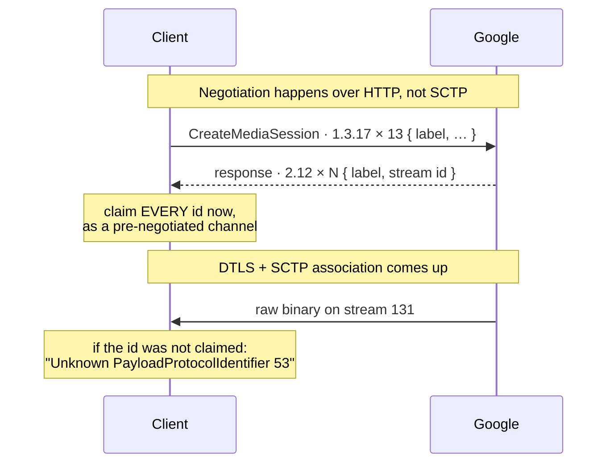
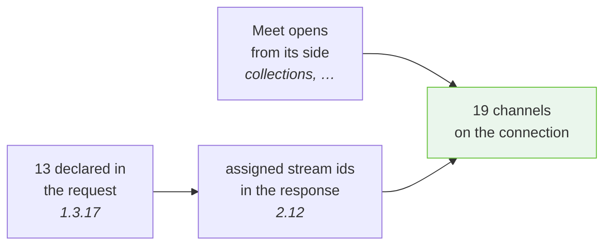
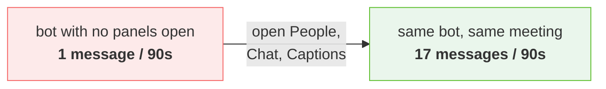
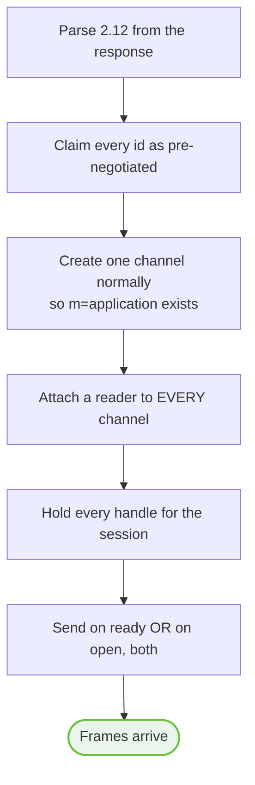

# 06 · Data channels

Nineteen of them. They carry everything the HTTP API does not, and **you will
not be told about any of them.**

---

## Why this page exists

The normal WebRTC contract is: a channel is announced by a DCEP `DATA_CHANNEL_OPEN`
control message, your stack fires `ondatachannel`, and you attach a handler.

Meet does not do that. It declares its channels in an **HTTP request**, tells you
which SCTP stream each will use in the **HTTP response**, and then writes binary
straight onto those streams. No DCEP. Ever.



A client that waits to be told about a channel is never told. The stack sees data
on a stream it has no channel for, tries to read it as a DCEP open message, and
reports something like:

```
Unknown PayloadProtocolIdentifier 53
```

— binary where it wanted a control message. **PPID 53 is WebRTC binary data.**
That error means *"a real message arrived on a stream you never claimed."*

---

## The rules

### 1 · Claim every assigned stream id up front

Not just the channels you intend to use. Create each as a **pre-negotiated**
channel with its assigned id — in most APIs, `negotiated: true` plus
`id: <stream id>`.

```
for (label, stream_id) in response.field_2_12:
    create_data_channel(label, negotiated=True, id=stream_id)
```

### 2 · Poll every claimed channel, not just the ones you act on

✅ **Proven, and vicious.** An unread channel has its receiver closed underneath
it, and the stack then reports `Disconnected` for deliveries on **every**
channel — including the ones you were reading.

The symptom is a session that works for a few seconds and then goes silent
everywhere at once, which reads like a network fault.

### 3 · Keep every handle alive

Dropping a channel handle does the same thing as not reading it. In a
garbage-collected or RAII language this is easy to do by accident: the channel
you created and never referenced again is the one that kills the session.

### 4 · You still need one locally-created channel

The `m=application` section in the session description is what brings the SCTP
association up at all. Without it the association never forms and SCTP arrives
with nowhere to go.

So: create one channel the ordinary way (DCEP), *and* claim all the
pre-negotiated ids.

> **And Meet replies on the channel you opened**, rather than on the
> pre-negotiated stream it assigned for that label. That one in particular has
> to survive. 👁 Observed.

### 5 · An incoming channel is already open

Meet is the DTLS server, so it takes the **odd** stream ids and opens some
channels from its side; they arrive through `ondatachannel`. **They are already
open when handed over — the open event has already been and gone.** Waiting for
it before sending is waiting forever.

Both paths are needed:

```
on_channel_ready(ch):
    if ch.is_open(): send_now(ch)
    ch.on_open = lambda: send_now(ch)     # in case it was not
```

### 6 · Do not send before the association exists

Sending on a locally-opened channel too early fails with `data channel not
existed` — **a stack warning, not an error the caller sees** — and costs the one
frame that makes Meet allocate anything.

---

## The nineteen channels

Traffic counts from one 90-second capture of a real client with panels open.

| Channel | Send / Recv | Role | Documented |
| --- | --- | --- | --- |
| `dcrpc` | 13 / 13 | generic sequenced RPC; **the busiest** | [08](08-dcrpc.md) |
| `media-session` | 4 / 4, ~5 KB | media negotiation | — |
| `media-director` | 3 / 3 | **stream allocation control** | [07](07-media-director.md) |
| `audioprocessor` | 0 / 7 | audio state, tiny frames | — |
| `meet_messages` | 1 / 1 | **outbound chat** | [09](09-collections-and-actions.md) |
| `collections` | 0 / 2 | **roster, chat, hand raises, meeting state** | [09](09-collections-and-actions.md) |
| `captions` | 0 / 1 | present, dormant in capture | ❓ |
| `reactions` | 0 / 0 | present, unused in capture | ❓ |
| `copresent` | 0 / 0 | presenting | ❓ |
| `coannotations` | 0 / 0 | annotation | ❓ |
| `meeting-agent` | low | unclassified | ❓ |
| `agenda` | low | unclassified | ❓ |
| `cohort` | low | unclassified | ❓ |
| `audio-mesh` | low | unclassified | ❓ |
| `video-processing` | low | unclassified | ❓ |
| `p2p` | low | unclassified | ❓ |
| `meet-p2p-signaling` | low | unclassified | ❓ |
| `s11y-sync` | low | "s11y" = stability | ❓ |
| `ignored` | low | literally named `ignored` | ❓ |

**Eighteen are created by the client; only `collections` arrives remotely.**

Full table with the request/response distinction →
[reference/data-channels.md](../reference/data-channels.md).

---

## Thirteen requested, nineteen present

The `CreateMediaSession` request declares **13** labels. Nineteen channels end up
on the connection. The gap is made up by channels Meet opens from its own side —
`collections` most importantly — and by labels that appear in the response
table without having been requested.



---

## Stream id assignment

👁 **Observed**, one session:

```
dcrpc           113
reactions       115
media-director  131
meet_messages   137
…               up to 159
```

Odd numbers only, range 111–159 — consistent with Meet holding the DTLS server
role, which by convention takes odd stream ids.

**They differ per session. Hardcoding them produces a client that works once.**

---

## The framing shared by media-director and dcrpc

Both channels use the **same outer frame**, which is worth stating once because
the two were decoded separately and it would be easy to implement it twice:

```
frame = { 1: <payload> }              plain
      | { 2: gzip(<payload>) }        compressed
```

**Meet compresses whichever frames it feels like** — larger ones, generally —
and there is no way to ask which. Both must be handled on receive. Sending
uncompressed is accepted.

```
def read_frame(bytes):
    f = parse(bytes)
    if 1 in f: return f[1]
    if 2 in f: return gunzip(f[2])
    return None
```

---

## Why the first capture found nothing

Worth reading before you conclude a channel is dead.

The first instrumentation of a real client saw **one** channel out of nineteen.
Not because eighteen were idle — because the instrumentation wrapped
`RTCPeerConnection` and patched `createDataChannel` on the **instance**.

Minified Closure output calls
`RTCPeerConnection.prototype.createDataChannel.call(pc, …)`, which walks straight
past an own-property shadow.

The only channel that showed up was `collections` — **the one channel Meet
creates remotely**, delivered through `ondatachannel` by a different code path
entirely. Every conclusion drawn about "the data channel" during that period was
drawn from the single channel that happened to arrive by a route the broken
instrumentation could still see.

Chat was declared missing three times while it was travelling over
`meet_messages` the whole way.

> **Rule:** when patching a browser API to observe it, **patch the prototype**.
> If one method needed it, all of them do.
> → [Capture methodology](13-capture-methodology.md)

---

## Subscription: silence is not emptiness

The second trap on this page, and it corrected a conclusion that had already been
written down as fact.

A 90-second capture with a participant deliberately talking, sending chat,
reacting, raising a hand, and toggling mute and camera produced **one** message
on `collections`: 33 bytes, gzipped to 13, nesting five levels deep to a single
`1`. A keepalive.

The bot was genuinely in the meeting throughout — three remote audio tracks
arrived for the duration.

**Meet pushes only what a client subscribes to.** Opening the People, Chat and
Captions panels before recording took the same capture from **1 message to 17**.
Same bot, same meeting, same actions. The only difference was clicking three
buttons first.



❓ **Unknown:** what a *native* client sends to subscribe. In the browser it is a
UI action; the underlying message has not been isolated. This is one of the more
valuable open questions. → [Open questions](14-open-questions.md)

**The lesson worth keeping:** ask whether the client was ever subscribed before
concluding a transport is unused. The original measurement was accurate and the
inference from it was wrong.

---

## Checklist



Miss any one of those and the symptom is silence, `Disconnected`, or
`Unknown PayloadProtocolIdentifier 53` — none of which name the cause.

---

**Next:** [07 · media-director](07-media-director.md) — how you ask to be sent
anything at all.
