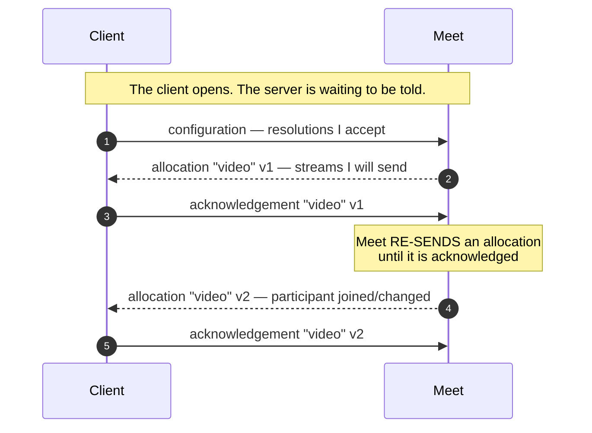
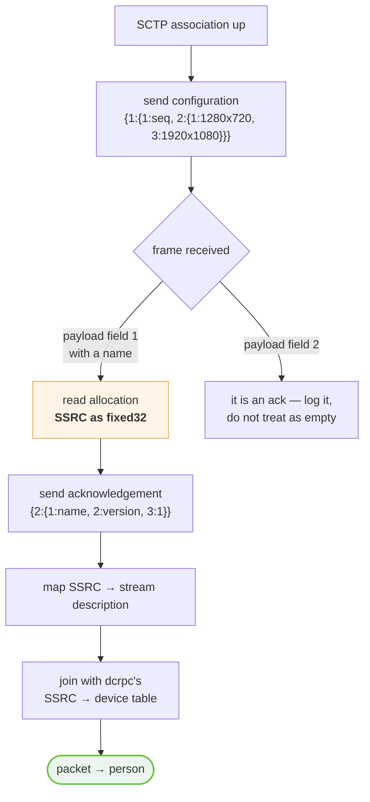

# 07 · media-director

The channel that decides whether your session carries anything at all.

**A connected media session receives nothing until the client says what it can
accept.** Nothing errors. Nothing logs. The peer connection sits in `connected`
and no RTP arrives. This is the single most common way to conclude, wrongly,
that the negotiation failed.

---

## The exchange

Symmetric request/acknowledgement, in both directions.



Acknowledgement is **not optional politeness**. Meet re-sends an allocation until
it receives one.

---

## Framing

Shared with [`dcrpc`](08-dcrpc.md):

```
frame   = { 1: payload }              plain
        | { 2: gzip(payload) }        compressed — Meet's choice, no way to ask

payload = { 1: request }              a request, in either direction
        | { 2: acknowledgement }
```

Handle both on receive; send plain.

---

## Message 1 · The client's configuration

The opening move, and the one whose absence produces total silence.

```
{ 1: { 1: <sequence>,
       2: { 1: { 1: 1280, 2: 720 },
            3: { 1: 1920, 2: 1080 } } } }
```

Two sizes, at fields **1 and 3** of the same message — not 1 and 2. The browser
sends 1280×720 and 1920×1080.

✅ **Proven byte-for-byte.** A captured opening frame, sequence 1:

```
0a 16 0a 14 08 01 12 10 0a 06 08 80 0a 10 d0 05 1a 06 08 80 0f 10 b8 08
│     │     │     │     │                    └─ field 3: 1920×1080
│     │     │     │     └─ field 1: 1280×720
│     │     │     └─ field 2: the sizes block, 16 bytes
│     │     └─ field 1: sequence = 1
│     └─ payload field 1 (request), 20 bytes
└─ frame field 1 (plain), 22 bytes
```

🧩 **Inferred** that these are a *capability* declaration rather than a request
for specific participants — the fields are sizes with no participant identity
anywhere in the message, and what comes back is a server-chosen set. What the
two slots distinguish (preferred vs maximum?) is ❓ unknown.

---

## Message 2 · Meet's allocation

What the server has decided to send you.

```
{ 1: { 1: "video",          allocation name
       2: <version>,        increments as participants change
       3: { 1: { 1: repeated <stream> } } } }

stream = { 1: { 1: { 1: <ssrc>  ← FIXED32 },
                2: { 1: width, 2: height },
                3: <frames per second>,
                4: <bits per second>,
                5: "<scalability mode>",     "L1T2" / "L1T3"
                6: <payload type> },
           2: 2 }
```

### ⚠️ The SSRC is a `fixed32`, not a varint

**The only one in this protocol.**

Read as a varint it yields a plausible-looking number that matches no arriving
packet — so the association silently fails, every packet is unattributable, and
the session looks empty while RTP is flowing perfectly.

```
wire bytes:  0d b9 5b 0c e6
             │  └──────────┘
             │  little-endian u32 = 3859569593
             └─ tag: field 1, wire type 5 (fixed32)
```

If your protobuf reader is a generic walker, this is the field it will get wrong.
Check for wire type 5.

### A decoded allocation

✅ **Proven** — captured from a real session, two streams:

| | Stream A | Stream B |
| --- | --- | --- |
| SSRC | `3859569593` | `1551570207` |
| Resolution | 960 × 540 | 960 × 540 |
| Frame rate | 30 | 30 |
| Bitrate | 1 000 000 | 1 500 000 |
| Scalability | `L1T3` | `L1T2` |
| Payload type | 98 (VP9) | 96 (VP8) |

One spatial layer, two or three temporal layers, in every allocation observed —
**no simulcast**, consistent with the SDP. → [Media plane](10-media-plane.md)

---

## Message 3 · The client's acknowledgement

By name and version:

```
{ 2: { 1: "video", 2: <version>, 3: 1 } }
```

✅ **Proven byte-for-byte**, acknowledging allocation 2:

```
0a 0d 12 0b 0a 05 76 69 64 65 6f 10 02 18 01
│     │     │     "video"        │     └─ field 3: 1
│     │     └─ field 1: name     └─ field 2: version = 2
│     └─ payload field 2 (acknowledgement), 11 bytes
└─ frame field 1 (plain), 13 bytes
```

---

## What is proven and what is not

✅ **The handshake completes.** The configuration frame goes out and Meet returns
its acknowledgement — byte-identical to the captured one:

```
0a 08 12 06 08 01 12 00 1a 00
```

— with a second participant present and sending.

❓ **The allocation does not reliably follow.** In a from-scratch client the
handshake is acknowledged and no allocation arrives.

**What sits between the two in the browser's capture** is a `dcrpc` exchange
(three sends, three receives, 109–312 bytes) and two `collections` frames. So
`dcrpc` is very likely a **prerequisite**, not an independent feature —
specifically the **stream registration** message, in which the client declares
its own SSRCs before Meet declares everyone else's.
→ [08 · dcrpc](08-dcrpc.md) · [14 · Open questions](14-open-questions.md)

The other candidate, ✅ proven necessary and now sent, is the
`UpdateMeetingDevice` call announcing `cloud_session_id`.
→ [03 · Join sequence](03-join-sequence.md)

---

## Two mistakes that hide this whole channel

Both produce "nothing happened" and neither produces an error.

### The frame written before the association existed

Sending on a locally-opened channel too early fails with `data channel not
existed` — a **stack warning**, not an error the caller sees — and it costs the
one frame that makes Meet allocate anything.

A channel Meet hands over is already open and its open event has been and gone,
so both paths are needed: **send now if the channel is ready, and again on open
if it was not.**

### Logging only allocations

An acknowledgement carries no streams. A logger that prints "N streams
allocated" makes a **replying** channel look identical to a **silent** one — the
acknowledgement went unseen for several runs, during which the channel was
believed dead.

Log every frame, decoded, in both directions. On this channel the absence of
streams is data.

---

## Implementation sketch



The allocation tells you **what** a stream is. `dcrpc` tells you **whose** it is.
Neither is sufficient alone.

---

**Next:** [08 · dcrpc](08-dcrpc.md) — sequenced RPC, and the table that turns a
packet into a person.
