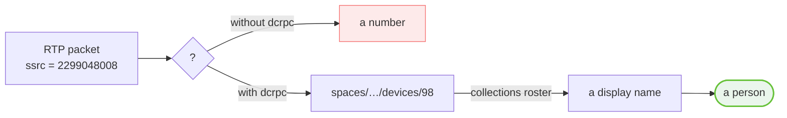
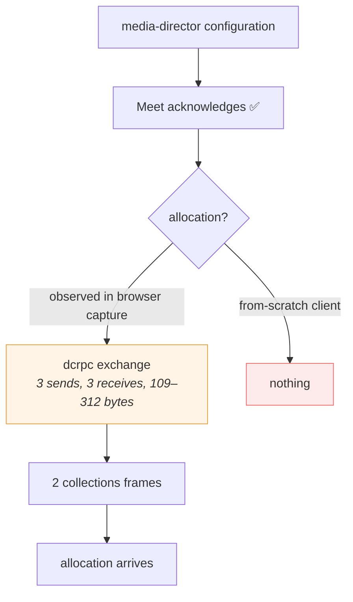

# 08 · dcrpc

The busiest of the nineteen channels, and a generic one. It is where a packet
becomes a person.

---

## What makes it unusual

Every frame is a **sequence number and a payload whose field number is the
method**. Nothing names a method in words, anywhere.

```
{ 1: <sequence>, <method>: <payload> }
                  ▲
                  └─ the field number IS the method
```

👁 **Observed method numbers:**

| Field | Direction | Meaning |
| --- | --- | --- |
| `2` | ? | ❓ unclassified |
| `3` | client → Meet | open a session |
| `3` | Meet → client | acknowledge the open |
| `4` | client → Meet | register the client's own streams 🧩 |
| `5` | Meet → client | announce other participants' streams |

This has a practical consequence: **a decoder cannot dispatch on a name.** It has
to switch on a field number, and unknown numbers will appear as Meet changes.
Treat unrecognised methods as data to log, not as errors.

---

## Framing

Identical to [`media-director`](07-media-director.md):

```
frame = { 1: message }            plain
      | { 2: gzip(message) }      compressed
```

Meet compresses the larger frames on this channel and not the smaller ones, with
no way to ask which.

---

## The opening request

Sent **twice** in a captured join, with `kind` = 2 then 1, before anything else
happens on the channel. ❓ What the two kinds distinguish is unread; both are
sent because a session that sends only one has never been observed to work.

```
{ 1: <sequence>,
  3: { 1: { 1: { 1: 53 },                      client kind — constant
            2: { 1: "<build id>",              e.g. boq_hlaneEXAMPLE0
                 4: "<debug id>" },            e.g. boq_hlane_<random>
            4: "en",                           locale
            7: { 1:1, 2:426, 3:1, 4:1, 5:8, 7:1 } },   ← client descriptor
       2: <kind>,                              2, then 1
       3: "<session id, BARE>",                no mediasessions/ prefix
       5: {} } }                               empty
```

### Two traps in one message

**1 · Field `7` is the same client descriptor that rides in
`x-goog-meeting-rtcclient`.** The header and the body carry *identical bytes*, so
getting one right and the other wrong is entirely possible and produces no
distinct symptom.

```
header:  x-goog-meeting-rtcclient: CAEQqgMYASABKAg4AQ==
body:    7: { 1:1, 2:426, 3:1, 4:1, 5:8, 7:1 }
                    ▲
                    └─ the same six fields, the same bytes
```

**2 · The session id appears here *without* its `mediasessions/` prefix**, where
`CreateMediaSession` uses it *with*. Sending the prefixed form names a session
Meet does not recognise.

```
CreateMediaSession   1.1  →  "mediasessions/EXAMPLEsessionoKAAiKYigCIAQQ"
dcrpc open            3   →  "EXAMPLEsessionoKAAiKYigCIAQQ"
UpdateMeetingDevice  1.22 →  "EXAMPLEsessionoKAAiKYigCIAQQ"
```

### The captured frame

✅ **Proven byte-for-byte.** The first frame of a real join, sequence 1, kind 2:

```
0a 6b 08 01 1a 67
   0a 43
      0a 02 08 35                          {1:{1:53}}  client kind
      12 2a
         0a 11 "boq_hlaneEXAMPLE0"         {2:{1: build id}}
         22 15 "boq_hlane_EXAMPLE0000"     {2:{4: debug id}}
      22 02 "en"                           {4:"en"}
      3a 0d 08 01 10 aa 03 18 01 20 01 28 08 38 01
                                           {7: client descriptor}
   10 02                                   {2: kind = 2}
   1a 1c "EXAMPLEsessionoKAAiKYigCIAQQ"    {3: session id, bare}
   2a 00                                   {5: {}}
```

Meet's reply:

```
{ 1: <sequence>, 3: { 1: { 1: 1 }, 3: { 1: <server time> } }, 4: {} }
```

✅ **Proven live:** both frames go out and both are acknowledged, in a real
meeting, from a from-scratch client.

---

## What the channel is actually for

Streams. The client registers its own SSRCs, and Meet announces everyone else's
— **each set named against the device that sends them.**

```
{ 4: "<label>",                       "audio", "video", or a bare SSRC
  6: "spaces/<space>/devices/<n>",    ← the participant's device
  8: { 1: repeated <ssrc> } }         ← the SSRCs they send on
```

That is the association the entire receiving side exists to obtain.



Without it an arriving packet is a number. With it a packet is a person. The
device path becomes a display name through the roster on
[`collections`](09-collections-and-actions.md).

### Parse by walking, not by path

⚠️ **Announcements sit at different depths depending on which method carried
them.** A fixed path finds nothing the moment Meet uses another method number.

Walk the message tree and treat as an announcement **anything that names a device
and lists SSRCs**:

```
def find_announcements(message, depth=0):
    if depth > 6: return            # bound it; byte strings can parse by accident
    f = parse(message)
    if is_device_path(f.get(6)) and f.get(8) has ssrcs:
        yield ParticipantStream(device=f[6], label=f.get(4), ssrcs=f[8][1])
    for nested in f.values_that_are_length_delimited():
        yield from find_announcements(nested, depth + 1)
```

Two guards that matter:

- **Bound the recursion.** Six levels reaches the deepest observed announcement
  with room to spare and stops a byte string that happens to parse as protobuf
  from recursing indefinitely.
- **Require field 6 to look like a device path** — it must contain `/devices/`.
  Any other string there is something else. And **reject entries with no
  SSRCs**: they describe nothing that can arrive, and keeping them attributes
  packets to a stream that was never offered.

---

## Actions ride here too

The envelope is generic, so new actions are very likely a different inner
payload rather than a different mechanism. 👁 **Observed** for mute:

```
1.1        varint   sequence number
1.2.4.1    varint
1.2.4.2    varint
1.2.4.3    string   session id
1.2.4.4    string   "audio"        ← the stream selector
1.2.4.5    string   opaque token   ← session-scoped, must be captured
1.2.4.10   { 1: <state> }
```

Sequenced request/response: send `08 08`, receive `08 08`. The response confirms
against `spaces/<id>/devices/<n>`.

🧩 **Camera is almost certainly the same message with `"video"` in field 4.**

⚠️ `1.2.4.3` and `1.2.4.5` are **session-scoped and must be captured at join
rather than constructed**. That opaque token at field 5 is the remaining blocker
for a native client performing actions on this channel — see
[Open questions](14-open-questions.md).

---

## Its role in getting media to flow

This is the current frontier, and worth stating precisely rather than
optimistically.



What is ✅ **proven**: the `dcrpc` handshake completes live, both frames
acknowledged.

What is 🧩 **inferred**: the missing piece is the **stream registration** — the
larger gzipped frame in which the client declares its own SSRCs before Meet
declares everyone else's. It sits at method field `4`, it is compressed, and it
has not been reproduced.

What is ❓ **unknown**: whether that alone unblocks allocation, or whether the
`collections` frames in between are also load-bearing.

---

## Summary

| | |
| --- | --- |
| **Dispatch on** | field number, not name |
| **Framing** | `{1: msg}` or `{2: gzip(msg)}` |
| **Session id** | bare — no `mediasessions/` prefix |
| **Client descriptor** | must match `x-goog-meeting-rtcclient` exactly |
| **Parse strategy** | walk, bounded to 6 levels, validate device paths |
| **Gives you** | SSRC → device, which is the whole receiving side |

---

**Next:** [09 · collections and actions](09-collections-and-actions.md) — the
resource model, and where each user action actually goes.
