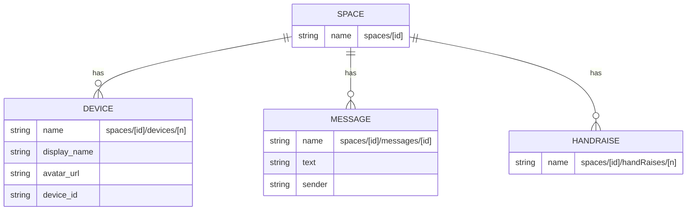
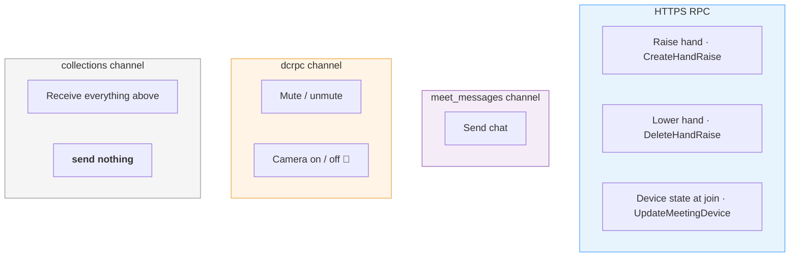
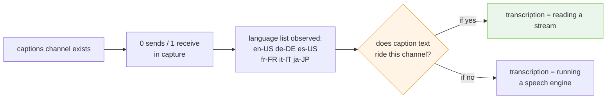

# 09 · collections and actions

Where meeting state comes from, and where each user action actually goes.

---

## Part 1 · The `collections` channel

The one channel Meet creates from **its** side and delivers through
`ondatachannel`. It carries the roster, chat, hand raises, and meeting metadata.

### The resource model

Self-describing and REST-shaped. This is the friendliest part of the entire
protocol.



```
spaces/<id>                     the meeting
spaces/<id>/devices/<n>         a participant's device
spaces/<id>/messages/<id>       a chat message
spaces/<id>/handRaises/<n>      a raised hand
```

Messages are **gzipped protobuf, 30–800 bytes**.

| Resource | Carries | Evidence |
| --- | --- | --- |
| `devices/<n>` | display name, avatar URL, device id | 👁 Observed |
| `messages/<id>` | message text with its sender | 👁 Observed |
| `handRaises/<n>` | create and delete events | 👁 Observed |
| `spaces/<id>` | meeting state | 👁 Observed |

**This is the channel that turns a device path into a person.** `dcrpc` gives you
`spaces/<id>/devices/98`; `collections` gives you the name and avatar for it.
→ [dcrpc](08-dcrpc.md)

### Receive-only

**There are zero data-channel sends on `collections` in any capture.** Outbound
actions never travel this way. If you are looking for where to *put* something,
it is not here.

### Subscription gates everything

Repeating the warning from [Data channels](06-data-channels.md) because this is
the channel it applies to:

> A bot that opens no panels receives **one keepalive in 90 seconds**. Opening
> People, Chat and Captions takes the same capture from **1 message to 17**.

❓ **The subscription message itself has not been isolated.** In the browser it is
a UI action. Finding what it sends — and on which channel — is one of the highest
value open questions here, because it gates the roster, chat, and possibly
captions all at once. → [Open questions](14-open-questions.md)

---

## Part 2 · The action surface is split across three transports

No single mechanism covers it. This is the fact that makes "just decode the data
channel" fail as a strategy.



| Action | Transport | Status |
| --- | --- | --- |
| Raise / lower hand | HTTP RPC — `CreateHandRaise` / `DeleteHandRaise` | 👁 decoded |
| **Send chat** | data channel — `meet_messages` | ✅ **encoder reproduces captured bytes** |
| Mute / camera | data channel — `dcrpc` | 👁 decoded, not encoded |
| Device state at join | HTTP RPC — `UpdateMeetingDevice` | ✅ Proven |
| Receive any of the above | data channel — `collections` | 👁 decoded |

---

## Part 3 · Sending chat

Channel: **`meet_messages`**. Not HTTP — three separate captures searched HTTP
traffic and found nothing while messages were going out here.

```
1 { 1 { 1: 1,
        3 { 1 { 2 { 3: <epoch ms>,
                    5 { 1: "<text>" },
                    6: 1 } } } } }
```

### The doubled wrapper

⚠️ **Note the doubled field 1 at the top.** The captured bytes open
`0a 31 0a 2f` — **two nested length-delimited wrappers before any content**.
Encoding one of them produces a message two bytes short that otherwise looks
entirely correct, parses cleanly, and is rejected.

### ✅ Proven byte-for-byte

A captured 51-byte message, `"probe message from the bot"` at epoch
`1785104796458`:

```
0a 31                                  ← wrapper 1
   0a 2f                               ← wrapper 2
      08 01                            {1: 1}
      1a 2b                            {3: …}
         0a 29
            12 27
               18 aa 96 a6 84 fa 33    {3: 1785104796458}
               2a 1c
                  0a 1a "probe message from the bot"
               30 01                   {6: 1}
```

Full hex → [reference/wire-samples.md](../reference/wire-samples.md).

The timestamp is 🧩 inferred to be used for ordering. It is a parameter, not a
clock read, which also makes an encoder testable.

---

## Part 4 · Mute and camera

Channel: **`dcrpc`**. Sequenced request/response — send `08 08`, receive
`08 08`.

```
1.1        varint   sequence number
1.2.4.1    varint
1.2.4.2    varint
1.2.4.3    string   session id
1.2.4.4    string   "audio"          ← the stream selector
1.2.4.5    string   opaque token     ← session-scoped
1.2.4.10   { 1: <state> }
```

The response confirms against `spaces/<id>/devices/<n>`.

🧩 **Camera is almost certainly the same message with `"video"` at field 4.** The
selector is a plain string naming a stream kind, which is about as clear a signal
as this protocol gives.

⚠️ **`1.2.4.3` and `1.2.4.5` are session-scoped and must be captured at join
rather than constructed.** The opaque token at field 5 has no known derivation —
this is the specific blocker for a fully native action path.
→ [Open questions](14-open-questions.md)

### The HTTP alternative

`UpdateMeetingDevice` also carries device state, field-masked:

```
1  resource     { 1: "spaces/<id>/devices/<n>", 14: { 2: <state> } }
2  update_mask  { 1: "audio_state" }
```

👁 Both paths were observed. ❓ Whether they are equivalent — whether the RPC
alone is enough to actually mute a live stream, or whether the `dcrpc` message is
what the media path listens to — is untested. The RPC is the easier one to try
first, since it needs no session-scoped token.

---

## Part 5 · Hand raise

The only user-visible action confirmed to travel purely over HTTP.

```
POST /$rpc/google.rtc.meetings.v1.MeetingHandRaiseService/CreateHandRaise
POST /$rpc/google.rtc.meetings.v1.MeetingHandRaiseService/DeleteHandRaise
```

Creates and deletes `spaces/<id>/handRaises/<n>`, which then appears on
`collections`. 👁 Observed; bodies not fully decoded, but the resource-name shape
is unambiguous.

---

## Part 6 · Captions

The highest-value unresolved item on this page.



The capture carried a **language list** (`en-US`, `de-DE`, `es-US`, `fr-FR`,
`it-IT`, `ja-JP`), so the machinery is exposed to this client rather than being
server-internal. But no caption text was ever seen on it — plausibly because
captions were not enabled, or because of the same subscription gate that hid
`collections`.

**One focused capture would settle it:** captions on, sustained speech, panels
open. → [Capture methodology](13-capture-methodology.md)

---

## Part 7 · What has never been seen

| Wanted | Status |
| --- | --- |
| Participant **email addresses** | ❓ Absent from every capture. Most plausible route: the invitee list on `FetchCalendarEvent`. |
| Reactions | Channel exists, zero traffic in every capture — likely the subscription gate again |
| Polls, Q&A, breakout rooms | ❓ Unknown; may be Workspace-tier only |
| Host controls: admit, remove, mute-all, end | 🧩 Likely RPCs; needs a meeting the test account **owns** |

---

**Next:** [10 · The media plane](10-media-plane.md) — the SDP that never crosses
the wire.
