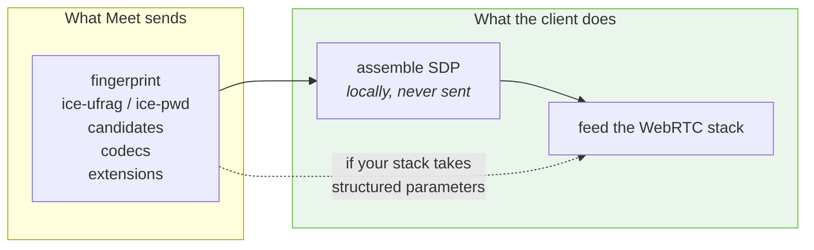
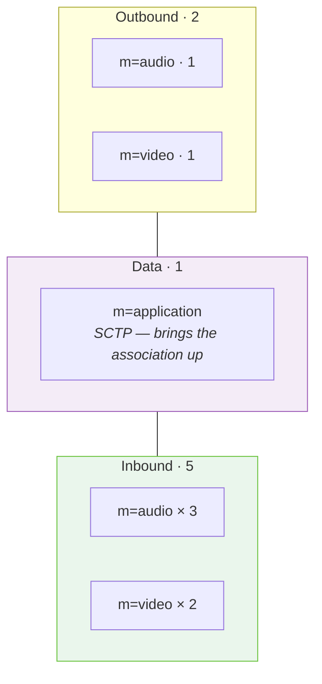
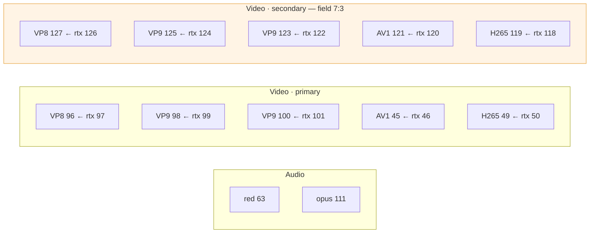
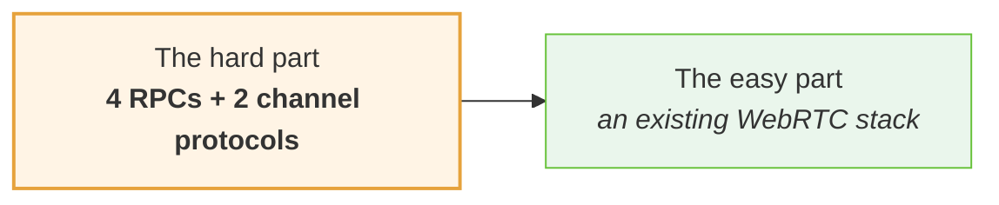

# 10 · The media plane

Below the signalling, Meet is **ordinary WebRTC**. That is the most useful single
fact in this document, because it means the hard part is four RPCs, not a media
stack.

---

## SDP never crosses the wire

Meet sends DTLS fingerprints, ICE credentials, ICE candidates, codec parameters
and header extensions as **structured protobuf fields**. The browser assembles a
session description locally from them.



**This is better than an SDP blob**, because a stack that accepts structured
parameters lets you skip the assembly step entirely. It is a step to skip, not to
reimplement.

If your stack insists on SDP text, assembly is deterministic — see below.

---

## What the browser's assembled answer says

👁 **Read off the answer a real client built**, for the same parameters:

```
UDP/TLS/RTP/SAVPF          standard DTLS-SRTP
a=setup:passive            Meet is the DTLS server; the client initiates
a=fingerprint:sha-256
a=ice-options:trickle
a=group:BUNDLE 0 1 2 3 4 5 6 7
a=rtcp-mux                 everything on one transport
no a=simulcast, no a=rid
codecs: opus VP8 VP9 AV1 H265 red rtx
12 header extensions in the answer
```

### The eight bundled m-sections



**1 audio + 1 video outbound, 1 SCTP data channel, then 3 audio + 2 video
inbound.**

The three-inbound-audio shape matches what Google's own
[Meet Media API](https://developers.google.com/meet/media-api) documents. That
correspondence is a useful sanity check: the reverse-engineered path and the
supported one expose the same underlying limit.

### Remote participants arrive as separate tracks

**The single most valuable property of this protocol for anyone building on it.**

Meet delivers one track per participant, so *who said what* is known at capture
time. Speaker attribution comes from the transport and needs **no diarization**.

Mixing streams and recovering speakers afterwards is work that only exists if the
separation is thrown away first.

---

## What you actually receive

👁 **Observed:** Meet sends **3 audio and up to 3 video** streams at a time,
choosing the most relevant participants.

In a large meeting you do not get everyone. The same limit is documented for the
official Media API, which makes it a property of the service rather than of this
client.

Which participants are chosen is the server's decision, informed by the
`media-director` configuration you sent. → [media-director](07-media-director.md)

---

## Two things assembly gets wrong

Both were got wrong first, and neither produces an error.

### 1 · The direction attribute is written from **Meet's** side

The answer says `a=sendonly`. **Meet sends; the bot receives.**

Writing `recvonly` — the bot's own point of view — describes two peers each
waiting for the other. It negotiates perfectly cleanly and carries nothing.

### 2 · The answer names codecs by payload type only

Clock rate, channel count and format parameters have to be **carried over from
the offer by payload type**, or every video codec ends up described at the audio
clock rate.

```
answer says:   2.4  { 1: 98, 2: "VP9" }
you must add:  clock rate 90000, from YOUR offer's entry for payload type 98
```

---

## The DTLS role

👁 The browser's answer says `a=setup:passive` — Meet is the DTLS server, the
client sends the ClientHello.

⚠️ **A caveat worth recording honestly.** In a from-scratch client, copying
`passive` produced a connection that reached `Connected` and carried encrypted
RTP nobody could read, with the stack reporting:

```
refusing first packet due to empty server_config
```

Tried as `active` on that evidence, and it was **worse**: ICE never left
`Connecting` at all. `passive` at least reaches `Connected`, so it stays — the
DTLS failure is something else, and ❓ remains unresolved.

This is included because it is the kind of detail that costs a day and does not
appear in any capture: the value the browser writes is not necessarily the value
your stack should write, and the two failure modes look nothing alike.

> Note the asymmetry with `CreateMediaSession` field `1.3.1.2/3`, which carries
> setup role **`3`** — a protobuf enum, not the SDP string. Do not conflate the
> two representations.

---

## ICE

`IssueIceServerConfig` returns Google STUN and TURN with credentials.
👁 **Observed:** the browser constructs its `RTCPeerConnection` with an **empty
`iceServers` list** and applies these afterwards via `setConfiguration`.

✅ A from-scratch client reached `connected` on the candidates in the
`CreateMediaSession` response alone — four of them, one session. Fetching the
config is likely necessary for restrictive networks and skippable otherwise.

### ICE credential shape

Meet has only ever been shown:

```
ice-ufrag   4 characters
ice-pwd    24 characters
```

RFC 5245 permits far wider ranges, and most WebRTC stacks default to 16 and 32.
Those defaults were, at one point, **the only remaining difference between a
rejected request and the browser's**. A strict server has no obligation to accept
the whole legal range — match the observed lengths.

Prefer alphanumerics. `+` and `/` are legal in these fields and Chrome emits
them, but dropping them costs nothing and keeps the values safe to paste into
anything that parses SDP loosely.

---

## Codecs

Meet offers **22**, in a specific order, under specific payload types.

Full table → [reference/codecs.md](../reference/codecs.md).

Three reasons the exact list is not negotiable:

1. **Offering a codec Meet does not know is enough for it to refuse the whole
   session.** A stack's defaults add H264, ulpfec and the 8 kHz telephony codecs.
2. **Payload types end up in RTP headers.** The right codecs under different
   numbers produce packets nothing can route.
3. **Every video codec is offered twice**, primary and secondary block, and every
   `rtx` entry must repair a codec **in its own block**. A secondary `rtx`
   pointing at a primary codec asks Meet to repair a stream it is not sending.



---

## RTP header extensions

Twenty declared. **The ids are the numbers that appear in the RTP headers Meet
sends back**, so changing one changes how every packet parses. Copy them
verbatim rather than assigning your own.

Five audio, fifteen video. The last one — `corruption-detection` — is the only
extension whose field `4` is `2` rather than `1`.

Full table → [reference/rtp-header-extensions.md](../reference/rtp-header-extensions.md).

A request with no extensions negotiates **no audio levels, no bandwidth
estimation, and no mid** — everything that makes a Meet stream readable.

---

## Assembling the answer, if your stack needs text

Deterministic. One bundled transport, one section per m-line in your offer:

```
v=0
o=- 0 0 IN IP4 127.0.0.1
s=-
t=0 0
a=group:BUNDLE 0 1 2 …          one mid per section
a=msid-semantic: WMS *

  per section:
m=<audio|video> 9 UDP/TLS/RTP/SAVPF <payload types>
c=IN IP4 0.0.0.0
a=rtcp:9 IN IP4 0.0.0.0
a=ice-ufrag:<from Meet>
a=ice-pwd:<from Meet>
a=ice-options:trickle
a=fingerprint:sha-256 <from Meet>
a=setup:passive
a=mid:<index>
a=sendonly                       ← Meet's point of view
a=rtcp-mux
a=rtpmap:<pt> <name>/<clock>[/<channels>]
a=fmtp:<pt> <params>             ← carried over from YOUR offer by payload type
```

Three details that break connections quietly:

- **Every section repeats the ICE credentials and fingerprint.** Under BUNDLE
  they share one transport, but the grammar still requires them per section.
  Omitting them from the non-first sections produces a description that parses
  and then fails to connect.
- **The section count must match your offer.** An answer with a different number
  of m-lines is rejected outright.
- **CRLF-terminate every line, including the last.** A bare newline is accepted
  by some stacks and rejected by others.

---

## Reading the offer back out

Most stacks mint their own ICE credentials and DTLS certificate and do not expose
either directly, so the practical route to the values
[`CreateMediaSession`](05-create-media-session.md) needs is to generate a local
offer and parse it:

| Wanted | From |
| --- | --- |
| fingerprint algorithm + value | `a=fingerprint:` — first occurrence |
| ice-ufrag / ice-pwd | `a=ice-ufrag:` / `a=ice-pwd:` — first occurrence |
| codecs with clock rate, channels, fmtp | `a=rtpmap:` + `a=fmtp:` |

Under BUNDLE every section repeats the same credentials and fingerprint, so the
first occurrence is the whole story.

**Do not parse candidates for the request.** Meet trickles its own back and never
asks for yours in this message; parsing them produces a field nothing reads.

---

## Why this is tractable

Everything below signalling — DTLS-SRTP, ICE, RTP, SCTP, the codecs themselves —
is off-the-shelf. Any mature WebRTC library already speaks all of it.



**The work is four RPCs, not a media stack.**

---

**Next:** [11 · Capabilities](11-capabilities.md) — what a client can actually
get and do.
