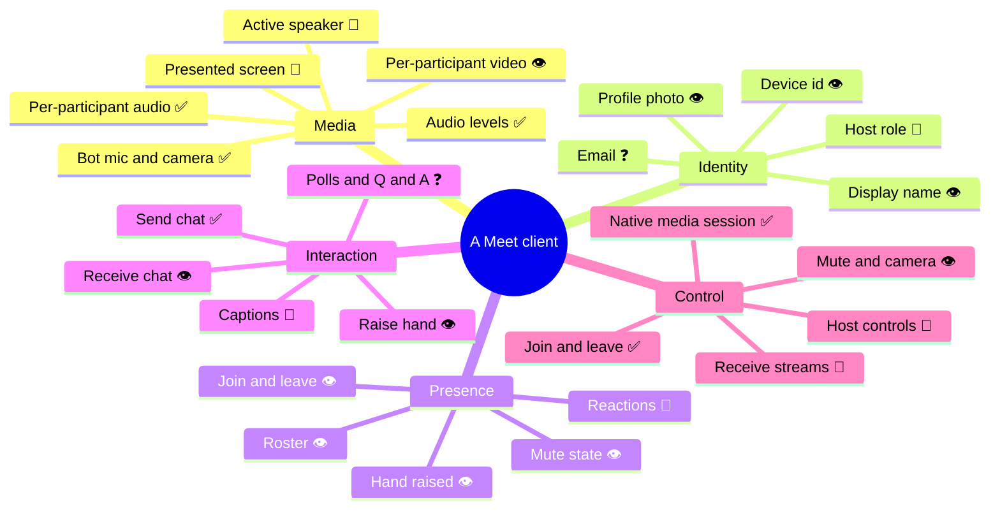
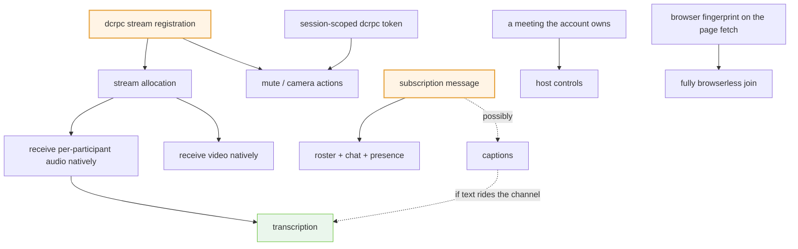

# 11 · Capabilities

What a client can get out of a meeting and put into one, and how sure we are
about each.

Wire-level detail lives in the earlier chapters; this is the capability view —
the page to check before promising a feature.

| Marker | Means |
| --- | --- |
| ✅ **working** | implemented and running against a real meeting |
| 👁 **seen** | observed in a capture, not implemented |
| 🧩 **likely** | Meet clearly has it; not yet located on the wire |
| ❓ **unknown** | may not be reachable from a participant at all |

---

## At a glance

---

## Media

| Capability | Source | Evidence |
| --- | --- | --- |
| Per-participant audio | media track | ✅ **working** — levels and per-speaker recordings |
| Per-participant video | media track | 👁 seen — 2 tracks when cameras are on |
| Presented screen | media track | 🧩 likely — another track, needs distinguishing |
| Bot microphone | media track (out) | ✅ working |
| Bot camera | media track (out) | ✅ working |
| Bot presenting | media track (out) | partial — via screen-share automation |
| Active speaker | data channel | 🧩 likely |
| Audio levels | media track | ✅ working |

**Meet sends 3 audio and up to 3 video streams at a time**, choosing the most
relevant participants. In a large meeting you do not get everyone — the same
limit the official Media API documents.

**Tracks arrive already separated by participant**, so knowing who said what
costs nothing and needs no diarization. This is the property most worth
protecting in whatever you build on top: mixing streams and recovering speakers
afterwards is work that only exists if the separation is thrown away first.

---

## Identity

| Capability | Source | Evidence |
| --- | --- | --- |
| Display name | `collections` / RPC | 👁 seen |
| Profile photo | `collections` / RPC | 👁 seen |
| Participant / device id | media track, `spaces/<id>/devices/<n>` | 👁 seen |
| **Email address** | — | ❓ **unknown — absent from every capture** |
| Host / co-host role | RPC | 🧩 likely |
| Anonymous vs signed-in | RPC | 🧩 likely |

Email never appeared anywhere. The most plausible route is the invitee list on
`FetchCalendarEvent`, which exists and is undecoded. Worth stating plainly
because "get participant emails" is a common requirement and this protocol does
not obviously offer it.

---

## Presence and state

| Capability | Source | Evidence |
| --- | --- | --- |
| Roster | `collections` | 👁 seen |
| Join / leave | `collections` — `devices/<n>` | 👁 seen |
| Hand raised | `collections` — `handRaises/<n>` | 👁 seen — create and delete |
| Mute state | `dcrpc` / `UpdateMeetingDevice` | 👁 seen |
| Camera state | `dcrpc` | 🧩 likely — same message, `"video"` |
| Reactions | `reactions` channel | 🧩 likely — channel exists, unused in captures |
| Knocking participants | RPC | 🧩 likely — host only |

> **All of this is gated by subscription.** A client that opens no panels
> receives one keepalive in 90 seconds. → [collections](09-collections-and-actions.md)

---

## Meeting information

| Capability | Source | Evidence |
| --- | --- | --- |
| Meeting code | given | ✅ working |
| Space id | page HTML / first RPC header | ✅ working |
| Calendar event — title, times, invitees | `FetchCalendarEvent` | 👁 seen, undecoded |
| Smart notes eligibility | RPC | 👁 seen |
| Recording state | `collections` | 🧩 likely |
| Lock state | RPC | 🧩 likely |

---

## Interaction

| Capability | Source | Evidence |
| --- | --- | --- |
| Send chat | `meet_messages` | ✅ **encoder proven** — reproduces captured bytes |
| Receive chat | `collections` — `messages/<id>` | 👁 seen — text with sender |
| Captions | `captions` channel | 🧩 likely — channel exists; language list observed |
| Send reaction | `reactions` channel | 🧩 likely |
| Raise hand | `CreateHandRaise` / `DeleteHandRaise` | 👁 seen |
| Polls, Q&A, breakout rooms | — | ❓ unknown — may be Workspace-only |

**Captions are the highest-value unresolved item in this whole document.** The
capture carried a language list (`en-US`, `de-DE`, `es-US`, `fr-FR`, `it-IT`,
`ja-JP`), so the machinery is exposed to this client. If caption text rides that
channel, transcription becomes *reading a stream* rather than *running a speech
engine* — a difference of an entire subsystem.

---

## Control

| Capability | Source | Evidence |
| --- | --- | --- |
| Join / leave | `CreateMediaSession` natively | ✅ working |
| Native media session | `CreateMediaSession` accepted, ICE connected | ✅ working |
| Receiving tracks | `media-director` + `dcrpc` | 🧩 handshake proven, allocation not |
| Mute / camera | `dcrpc` | 👁 seen — blocked on a session-scoped token |
| Present / stop | media track | partial |
| Admit or deny a knock | RPC | 🧩 likely — host only |
| Remove participant, mute others, end meeting | RPC | 🧩 likely — host only |

Host controls need a meeting where the client's account **is** the host. Untested
for a simple reason: nobody set one up. It is the cheapest unexplored area here.

---

## The dependency graph

What unblocks what, if you are deciding where to spend effort.

**Two nodes unblock most of the graph:** the `dcrpc` stream registration message,
and whatever the browser sends when a panel is opened.

---

## Where to spend effort next

In order of value per hour, given everything above:

1. **`dcrpc` stream registration.** Unblocks the entire receive path. The
   handshake is proven; the missing frame is method field `4`, gzipped.
2. **The subscription message.** Unblocks roster, chat, presence, and possibly
   captions in one go. Isolate it by capturing a session while clicking one panel
   and diffing against a session where none was opened.
3. **Captions.** One focused capture: captions on, sustained speech, panels open.
4. **Host controls.** Needs a meeting the test account owns. Cheap, unexplored.
5. **Browser fingerprint on the page fetch.** Removes the last browser
   dependency for the space id — though **not** for the meeting token, which has
   no known derivation at all.

---

**Next:** [12 · Failure modes](12-failure-modes.md) — every trap found, with
symptom, cause and fix.
