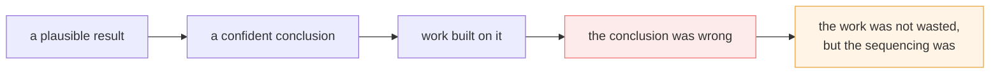

# 12 · Failure modes

Every trap found, with its symptom, its cause, and its fix.

**This is the most useful page here.** Read it before writing code, not after.
Nearly every entry below produced a *plausible* result — which is why each one
cost a capture, a round trip, or a week.

---

## Symptom → cause

Start here. Find your symptom, follow the link.

| Symptom | Likely cause | Where |
| --- | --- | --- |
| `400 This RPC requires a meeting token…` | header absent | [§1](#1-credentials) |
| `400 Request contains an invalid argument` on the media call | **wrong token scope**, or missing debug id, or body | [§1](#1-credentials), [§2](#2-the-body) |
| `401 missing required authentication credential` | `origin` not sent | [§1](#1-credentials) |
| `403 The caller does not have permission` | acting on another participant's device | [§1](#1-credentials) |
| `404` on an RPC | wrong service prefix, not a bad body | [§2](#2-the-body) |
| Page fetch returns 200 with **no space id** | incomplete browser fingerprint | [§2](#2-the-body) |
| ICE reaches `connected`, **no media ever arrives** | no `media-director` configuration sent | [§3](#3-media-that-never-arrives) |
| `Unknown PayloadProtocolIdentifier 53` | an SCTP stream id was never claimed | [§3](#3-media-that-never-arrives) |
| `data channel not existed` (a *warning*) | sent before the SCTP association existed | [§3](#3-media-that-never-arrives) |
| Everything goes `Disconnected` at once, seconds in | a claimed channel was never polled, or its handle dropped | [§3](#3-media-that-never-arrives) |
| SSRCs decode to plausible numbers matching no packet | SSRC read as varint instead of `fixed32` | [§3](#3-media-that-never-arrives) |
| Connection connects, RTP arrives, nothing decrypts | DTLS role — unresolved | [§3](#3-media-that-never-arrives) |
| A data channel looks completely empty | client never subscribed, **or** your instrumentation is broken | [§4](#4-instrumentation-that-lies) |
| Chat "missing" from every capture | 18 of 19 channels invisible — instance patching | [§4](#4-instrumentation-that-lies) |
| A test passes while the code is wrong | test written from the code, not the capture | [§5](#5-reasoning-traps) |

---

## 1 · Credentials

### The two token caches must not be merged

> ✅ **The most expensive single mistake in this protocol.**

**Symptom.** `400 invalid argument` on `CreateMediaSession` — the same words used
for a malformed body — while `UpdateMeetingDevice` succeeds at the same moment.

**Cause.** Meet keeps **two** token caches. State calls rotate theirs from
`X-Goog-Meeting-Token` response headers; the media call keeps the bootstrap value
forever. A single "always keep the newest token" cache substitutes a state token
into the media call.

**Fix.** Scope by service name: `…MediaSessionService` → media token (never
rotates), everything else → state token (rotates).

**Diagnostic.** Log both cached token *lengths*. Bootstrap values run 261
characters and rotated state values 282 or 304 — **equal lengths mean the scoping
has collapsed**.

**Why it hid so well:** writes are state-scoped, so a `UpdateMeetingDevice`
succeeding "proved" the credentials were fine. It proved the *state* credentials
were fine. → [Authentication](02-authentication.md)

### `origin` must be sent, not just signed

**Symptom.** `401 missing required authentication credential` — which points at
the cookies.

**Cause.** The signature is computed over the origin and the server checks the
two agree. Hashing an origin without sending it produces a signature the server
cannot verify.

**Fix.** `Origin: https://meet.google.com`.

### `x-goog-meeting-debugid` is required on the media call

**Symptom.** `400 invalid argument` with a correct media token and a correct
body.

**Cause.** It had been recorded as optional telemetry. It is not.

**Fix.** Capture it from the browser's own `CreateMediaSession`, alongside the
token it was sent with — **the two belong to the same request**.

```
gzip · 261-char media token · no debug id    →  400 invalid argument
gzip · 261-char media token · with debug id  →  200, 5222-byte answer
```

### `403` is a probe, not a failure

**Symptom.** `403 The caller does not have permission` on
`UpdateMeetingDevice`.

**Cause.** You named someone else's device. The roster does not say which device
is yours.

**Fix.** Try each in turn — Meet answers `403` for another's and `200` for your
own, so the search is self-correcting.

---

## 2 · The body

### `1.3.3.3` is the media kind, not a clock rate

**Symptom.** `400 invalid argument`, naming nothing.

**Cause.** The field sits between the codec name and the clock rate, so it reads
like a second rate. It is `1` for audio, `2` for video, on **every** codec, and
omitting it alone is enough for refusal.

**Fix.** Add it. And note the meta-lesson: **a field's meaning cannot be read
from its position.**

### The codecs nest inside the transport block

**Symptom.** `400 invalid argument`.

**Cause.** Codecs written at `1.3` beside the transport block rather than at
`1.3.3` inside it. Both encode cleanly.

### `1.3.17.7` is opaque bytes, not a message

**Symptom.** Silent corruption — request encodes fine, is refused.

**Cause.** The two bytes `02 01` read as a nested message describe field number
**zero**, which protobuf does not allow. A decoder produces nothing; a
re-encoder writes `{2: 1}` instead. Both encode cleanly and only the server can
tell them apart.

**Fix.** Carry unparseable bytes verbatim. **Bytes that fail to parse as a
message are bytes, not a puzzle.**

### A client-minted id is not arbitrary

**Symptom.** `400 invalid argument` for a session name of exactly the right
length and alphabet.

**Cause.** Eighteen captures agree on the **last eleven of its twenty-one
bytes**. A fully random id is refused exactly as loudly as a malformed one.

**Fix.** `random(10) ++ 0a0a00088a622802200410`, base64url **unpadded**.

**Bonus trap.** Standard base64 eventually emits a `/` into the middle of one,
turning a two-segment resource name into three. Roughly one session in sixty; it
looks like a server fault.

### The setup role is 3

🧩 guessed at `1` because `actpass` is the first of three roles. 👁 the capture
says `3`, in both `1.3.1.2` and `1.3.1.3`.

### ICE credentials at fields 3 and 4

Not 1 and 2. And match the observed lengths — 4-character ufrag, 24-character
password — rather than your stack's defaults of 16 and 32.

### `404` means the method, `400` means the body

**Use this.** If a service name is inferred rather than captured, ask for a
method that certainly does not exist and compare. One round trip settles it.

### The page fetch needs a full browser fingerprint

**Symptom.** `200 OK`, valid HTML, **no space id anywhere in it**.

**Cause.** Google serves a different document to a client lacking `sec-ch-ua`,
`sec-fetch-*` and the rest of the client hints. Cookies and a Chrome user-agent
are not enough.

**Status.** ❓ Unfinished, but bounded — the browser's own document (2.28 MB)
does contain it. → [Open questions](14-open-questions.md)

---

## 3 · Media that never arrives

### A connected session carries nothing

**Symptom.** ICE `connected`, DTLS complete, zero RTP. No error anywhere.

**Cause.** Meet allocates nothing until the client sends a `media-director`
configuration frame saying what resolutions it accepts.

**Fix.** Send it. → [media-director](07-media-director.md)

### Claim every SCTP stream id up front

**Symptom.** `Unknown PayloadProtocolIdentifier 53`.

**Cause.** Meet's channels are pre-negotiated. It assigns each an SCTP stream id
in the `CreateMediaSession` response and **writes binary straight onto it with no
DCEP open message**. The stack sees data on a stream it has no channel for and
tries to read it as a control message. PPID 53 is WebRTC binary data.

**Fix.** Create every assigned id as a pre-negotiated channel before the
association comes up.

### Poll every claimed channel, and keep every handle

**Symptom.** Deliveries on **every** channel start reporting `Disconnected` a few
seconds in — including channels you were reading successfully.

**Cause.** An unread channel has its receiver closed underneath it, and that
takes the rest down with it. Dropping a handle does the same.

**Fix.** Attach a reader to every claimed channel, whether or not you act on it,
and hold every handle for the life of the session.

### Send timing: both paths, always

**Symptom.** The configuration frame silently never goes out. The stack logs
`data channel not existed` — **a warning, not an error the caller sees**.

**Cause.** Sent before the SCTP association existed. Meanwhile a channel Meet
hands over is *already open* when handed over, so its open event has been and
gone — waiting for it is waiting forever.

**Fix.**
```
if channel.is_open(): send_now()
channel.on_open = send_now        # both, not either
```

### The SSRC is a `fixed32`

**Symptom.** SSRCs decode to plausible numbers that match no arriving packet. The
session looks silently empty while RTP flows perfectly.

**Cause.** It is the **only** `fixed32` in this protocol. A generic varint walker
gets it wrong. Wire type 5.

### The direction attribute is written from Meet's side

**Symptom.** Clean negotiation, no media.

**Cause.** `a=recvonly` — the bot's own point of view — describes two peers each
waiting for the other. The answer is Meet's: **Meet sends**, so `a=sendonly`.

### Carry codec details over by payload type

**Symptom.** Every video codec described at the audio clock rate.

**Cause.** The answer names codecs by payload type only. Clock rate, channels and
fmtp must be carried over from **your** offer, matched by payload type.

### DTLS role — unresolved

**Symptom.** `Connected`, RTP arriving, nothing decrypts:
`refusing first packet due to empty server_config`.

**Status.** ❓ `passive` matches the browser and reaches `Connected`. `active`
was worse — ICE never left `Connecting`. Recorded honestly as unresolved.

---

## 4 · Instrumentation that lies

Every entry here produced *plausible* output. That is exactly why each cost a
capture.

### Patch the prototype, not the instance

> **The single most expensive instrumentation bug found.**

**Symptom.** 18 of 19 data channels invisible. Chat declared missing **three
times** while it was travelling over `meet_messages` the whole way.

**Cause.** Minified Closure output calls
`RTCPeerConnection.prototype.<method>.call(pc, …)`, which walks straight past an
own-property shadow on the instance.

**How it hid.** The only channel that showed up was `collections` — the one
channel Meet creates *remotely*, delivered by a different code path the broken
patch could still see. Every conclusion about "the data channel" during that
period came from that one channel.

**Rule.** If one method needed prototype patching, **all of them do**. This was
found and fixed for `setRemoteDescription` and left unfixed for
`createDataChannel`, in the same file, for several more captures.

**It surfaced only because a human watching the meeting said the chat message
had arrived, contradicting the capture.** Instrumentation that reports nothing is
not evidence of nothing happening.

### Hook before the page's own code loads

Meet captures its own references as it initialises. Patching after that point
patches nothing it will use. **That timing is the whole trick.**

### Read bodies from the `Request` object, not just `init.body`

Meet builds `Request` objects, so every signalling payload was invisible. A
`CreateMediaSession` with no SDP in it looked like a *finding*. It was a blind
spot.

### Capture responses, not just requests

The SDP answer comes **from** the server. A request-only capture can never show
where it comes from.

### Do not truncate bodies

The single most important artefact — a 1229-byte `CreateMediaSession` request —
was captured at 20% because of a 256-byte truncation limit.

### Scan the whole document

Looking for the space id in `<script>` tags found one: the **previous** meeting's,
from a recent-meetings list. **A partial scan that finds something plausible is
worse than one that finds nothing, because it stops the search.**

### Sort captures by modification time

Filenames are UTC and will mislead you. Analysing a stale file produces a stale
conclusion delivered confidently.

### Silence is not emptiness

A 90-second capture with a participant deliberately talking, chatting, reacting
and raising a hand produced **one** message on `collections`. The measurement was
accurate. The inference — *"this channel carries nothing"* — was wrong, and got
written down as a finding.

**Meet pushes only what a client subscribes to.** Opening three panels took the
same capture from 1 message to 17.

**Ask whether the client was ever subscribed before concluding a transport is
unused.**

---

## 5 · Reasoning traps

The methodological ones. These generalise beyond Meet.

### Run the control experiment first

Five separate corrections were made to the `CreateMediaSession` body — nesting,
setup role, media kind, opaque bytes, extension flags — each followed by a round
trip returning the same `400`. Only afterwards was a browser request replayed
byte for byte. **It was refused too**, which means none of those five rounds
could ever have fixed it.

The corrections were real and the code was better for them. The **sequencing**
was not.

> **The control experiment that invalidates a whole line of enquiry is the
> cheapest one to run, so run it first.**

### …but a control only controls what it holds fixed

The byte-identical replay looked decisive: *if the server rejects its own
client's request, the body cannot be the problem.* The inference was sound. The
premise was not — the replay held the **body** constant while letting the
**token scope** vary, so it never tested what it claimed to.

It also produced a confident wrong conclusion: that a TLS or HTTP fingerprint
check must be involved. A plain native HTTP call was accepted an hour later.

### Change one thing between runs

The body corrections and the token rotation landed together. The token was right
while the body was wrong, then the body was right while the token was wrong, and
the two were never right together — which reads from the outside as *"the body
fixes did nothing."*

**Changing two things between runs destroys the run.**

### A finding about *what* does not tell you *how many*

"The meeting token is server-issued and rotates through response headers" was
entirely correct. Implementing it as **one** rotating cache broke the media call.
Meet keeps two.

### Do not read meaning from position

`1.3.3.3` sits between the codec name and the clock rate and was recorded as
"3, 4: clock rate" — two fields for one value. It is the media kind.

### Do not write tests from the code

A test asserting *three occurrences of field 3 at the top level* passed happily
while the encoder was wrong, because it was written from what the encoder
produced. The capture said `1.3.3`.

**Write protocol tests from the capture, and pin actual bytes rather than
lengths.** A length check cannot distinguish a space id from a meeting code —
both are twelve characters.

### An inference wearing a fact's clothing

The meeting token was recorded as browser-generated attestation because it begins
`ADmEuv` and no attestation endpoint was contacted. It is server-issued: the
first value is in the page's inline bootstrap as **aligned base64**, and later
ones arrive in response headers.

The search that "proved" it was absent from the HTML looked for **plain text**.

### Cache keys must identify the input, not merely postdate it

Not protocol, but it cost a session and generalises. A conversion cache keyed on
*"is the output newer than this source"* silently replayed a previous file
whenever a **different** source happened to be older. The symptom was the wrong
content with nothing in the log to say so — because *"reusing"* was the honest
description of what it was doing.

**A cache key has to identify the input.** Every existing test passed, because
they only ever converted one file.

---

## The meta-lesson

Nearly every entry above has the same shape:



The defence is not to be more careful. It is to **mark every claim with what was
actually run to establish it**, so that when something later contradicts it, you
know immediately which claims are load-bearing and which were always guesses.

That is what the evidence markers in this repository are for.

---

**Next:** [13 · Capture methodology](13-capture-methodology.md) — how to
reproduce and re-verify any of this.
