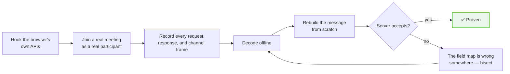
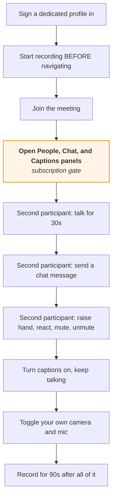

# 13 · Capture methodology

How every claim in this repository was produced, and how to re-verify it when
Google changes something.

**Assume it will change.** This is a proprietary, unversioned, server-controlled
protocol. The value of this document degrades over time; the value of the method
does not.

---

## The approach



Two phases, and the second is what separates 👁 **observed** from ✅ **proven**.
Watching traffic tells you what a message looks like. Rebuilding it from scratch
and having the server accept it tells you that you understood it.

Everything marked ✅ in this repository survived phase two.

---

## Phase 1 · Instrumentation

### What to hook

```
RTCPeerConnection.prototype.createOffer
RTCPeerConnection.prototype.createAnswer
RTCPeerConnection.prototype.setLocalDescription
RTCPeerConnection.prototype.setRemoteDescription
RTCPeerConnection.prototype.addIceCandidate
RTCPeerConnection.prototype.createDataChannel
RTCPeerConnection  — the constructor, for ondatachannel
RTCDataChannel.prototype.send
                   — and the message event, per channel
fetch
XMLHttpRequest.prototype.open / send
WebSocket          — to confirm it is genuinely unused
```

### The five rules

Each of these was learned by getting it wrong. → [Failure modes](12-failure-modes.md)

**1 · Hook before the page's own code loads.** Meet captures its own references
as it initialises. This timing is the whole trick — a hook installed after the
bundle runs patches nothing Meet will actually call.

**2 · Patch the prototype, never the instance.** Minified Closure output calls
`RTCPeerConnection.prototype.<method>.call(pc, …)`, walking straight past an
own-property shadow. This alone hid 18 of 19 data channels.

**3 · Read bodies from the `Request` object too**, not only `init.body`. Meet
builds `Request` objects, so a naive `fetch` hook sees empty payloads.

**4 · Capture responses, not just requests.** The answer parameters, the channel
table, and the rotating tokens all come *from* the server.

**5 · Do not truncate.** A 256-byte cap captured the most important artefact in
the protocol at 20%.

### Sketch

```js
// Install this before any page script runs.
const PC = RTCPeerConnection.prototype;

for (const name of ["createDataChannel", "setRemoteDescription",
                    "setLocalDescription", "addIceCandidate"]) {
  const original = PC[name];
  PC[name] = function (...args) {
    record({ kind: "pc", method: name, args: serialise(args) });
    const result = original.apply(this, args);
    if (name === "createDataChannel") instrumentChannel(result);
    return result;
  };
}

function instrumentChannel(ch) {
  const send = ch.send.bind(ch);
  ch.send = (data) => { record({ kind: "dc-send", label: ch.label, data: bytes(data) }); return send(data); };
  ch.addEventListener("message", (e) => record({ kind: "dc-recv", label: ch.label, data: bytes(e.data) }));
}
```

`ondatachannel` needs the constructor wrapped as well, since `collections`
arrives that way.

---

## Never record credentials

**Non-negotiable, and worth building into the recorder rather than remembering.**

| Header | Record |
| --- | --- |
| `authorization` | name, length, **12-character prefix only** |
| `cookie` | name, length, **12-character prefix only** |
| `x-goog-meeting-token` | epoch part in full; **opaque part truncated** |
| everything else | in full — they are structural |

Two of those are live Google session credentials. A capture directory also
accumulates display names and profile-photo URLs of everyone in the meeting.

**Treat a capture directory as containing personal data of people who did not
consent to being recorded.** Gitignore it, keep it local, delete it when done.
Nothing in this repository is derived from a capture without being reduced to
structure first.

---

## Phase 2 · Decoding

### The wire formats, again

```
request body    gzip → protobuf         starts 1f 8b 08
response body   base64 → protobuf       entirely printable ASCII
channel frame   {1: msg} or {2: gzip(msg)}
```

### Use a generic protobuf walker

There is no schema. Decode by wire type into a `(field number, value)` tree and
print it. `protoc --decode_raw` works for one-off messages; a walker you control
is better because you need to handle the two traps:

- **`fixed32`.** Wire type 5. The SSRC in a `media-director` allocation is the
  only one, and reading it as a varint produces a plausible wrong number.
- **Ambiguous length-delimited fields.** A byte string can parse as a nested
  message by accident. Try both, prefer the nested reading only when it consumes
  the whole field exactly, and **bound your recursion** — six levels covers
  everything observed here.

### Diff across captures

The technique that produced most of the field map:

> Twenty captures of `CreateMediaSession`, **all 2893 bytes decompressed**.
> Anything that did not vary across twenty sessions is a constant. Anything that
> did is a parameter.

That is how the 11-byte constant tail in the session id was found, and how the
one-of-thirteen channel with a different opaque value was noticed.

### Sort by modification time, not filename

Filenames are UTC and will mislead you. Analysing a stale file produces a stale
conclusion, delivered confidently.

---

## Phase 3 · Reproduction

The step that earns a ✅.

### Change one thing between runs

The most expensive lesson in the whole investigation. Two simultaneous changes
destroy the run: body corrections and token rotation landed together, and the two
were never right at the same time, which read as *"the body fixes did nothing."*

### Run the invalidating experiment first

Before correcting a body a fifth time, replay a browser-captured request byte for
byte. If that is refused, no amount of body work can be the answer.

**But hold everything fixed.** A replay that varies the credentials while holding
the bytes constant tests the one thing you did not mean to test.

### Prove it with the browser closed

A native call that only worked while the page was alive would be
indistinguishable from one that genuinely worked. Shut the browser down *before*
the native calls begin — deliberately.

### Pin bytes, not lengths

Every regression test in the source this was derived from asserts **captured
bytes**, not shapes:

- the `dcrpc` opening frame, byte for byte
- the `media-director` configuration and acknowledgement, byte for byte
- a 51-byte chat message, byte for byte
- the meeting identifier header's exact prefix

A length assertion cannot distinguish a space id from a meeting code — both are
twelve characters. And a test written from your own encoder passes while the
encoder is wrong.

---

## A useful capture protocol

If you want one session that answers as many questions as possible:



**Step D is the one people skip**, and skipping it produces a capture that
"proves" the roster and chat channels are empty.

Do all of it with **two** real participants. Most of the interesting traffic —
allocations, SSRC announcements, roster deltas — only exists when someone else is
sending.

---

## Verifying this document against a current Meet

A checklist for re-testing after a Google change. Roughly in order of how likely
each is to have moved.

| Check | How | If it moved |
| --- | --- | --- |
| Request/response encodings | first bytes of a captured pair | rewrite [01](01-transport.md) |
| Authorization header length | 195 for three signatures at 10-digit epoch | rewrite [02](02-authentication.md) |
| Token scoping | log both cache lengths; equal = collapsed | rewrite [02](02-authentication.md) |
| `CreateMediaSession` size | 2893 bytes decompressed | re-diff the field map, [05](05-create-media-session.md) |
| Codec list and payload types | decode `1.3.3` | update [reference/codecs.md](../reference/codecs.md) |
| Channel labels | decode `1.3.17` | update [reference/data-channels.md](../reference/data-channels.md) |
| Stream id range | decode `2.12` | expected to vary per session — not a regression |
| Session id constant tail | last 11 bytes of `1.1` across ≥3 sessions | update [05](05-create-media-session.md) |
| `media-director` frames | compare against the byte samples | rewrite [07](07-media-director.md) |
| `dcrpc` opening frame | compare against the byte sample | rewrite [08](08-dcrpc.md) |

Byte samples to compare against →
[reference/wire-samples.md](../reference/wire-samples.md).

---

## Ethics of capturing

Say this out loud before doing any of it:

- Capture only meetings **you are a participant of**, with an account you own.
- Everyone else in the meeting is in your capture. Their names, avatars, speech,
  and chat are personal data.
- Reduce captures to **structure** as fast as possible and delete the raw
  material. Nothing in this repository contains a name, an avatar, a cookie or a
  live token — that was a constraint on the work, not a cleanup afterwards.
- Recording a meeting is regulated in most jurisdictions and generally requires
  the participants' consent. Whether you have it is your problem.
- Automating Meet violates Google's Terms of Service. Use an account you can
  afford to lose.

---

**Next:** [14 · Open questions](14-open-questions.md) — what is still unknown,
and how to attack each one.
