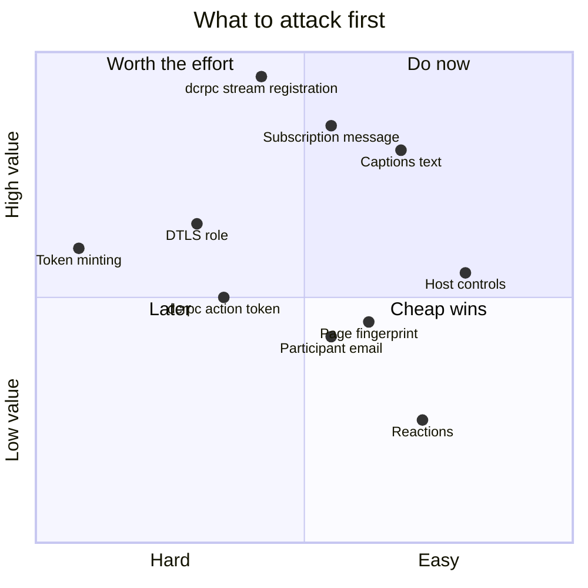

# 14 · Open questions

The honest boundary of this document. Each entry says what is unknown, why it
matters, what is already known that constrains the answer, and the cheapest
experiment that would settle it.

Ordered by value per hour of effort.

---

## Priority map



---

## 1 · The `dcrpc` stream registration message

❓ **Unknown.** The exact bytes of the frame in which a client declares its own
SSRCs.

**Why it matters.** It is the most likely remaining blocker on the entire receive
path. Without allocation, a session connects and carries nothing.

**What is known.**

- ✅ The `dcrpc` handshake completes live — both opening frames acknowledged.
- ✅ The `media-director` configuration is acknowledged, byte-identically to the
  browser's.
- ✅ `UpdateMeetingDevice` announcing `cloud_session_id` is accepted.
- 👁 In the browser's capture, what sits between the acknowledgement and the
  first allocation is a `dcrpc` exchange — **three sends, three receives, 109 to
  312 bytes** — and two `collections` frames.
- 🧩 The registration is method field `4`, and it is the larger, gzipped frame.

**Cheapest experiment.** Capture a browser join with `dcrpc` frames recorded in
full and gunzipped, and diff records 184–198 against a from-scratch session that
stops after the acknowledgement. The delta is the answer.

**Second experiment.** Determine whether the two `collections` frames in between
are load-bearing or incidental, by sending only the `dcrpc` registration and
seeing whether allocation follows.

---

## 2 · The subscription message

❓ **Unknown.** What a client sends to start receiving roster, chat and presence
updates.

**Why it matters.** It gates `collections` entirely, and possibly `captions` and
`reactions` too. One message unblocks most of the non-media capability surface.

**What is known.**

- ✅ A client with no panels open receives **1 keepalive in 90 seconds**.
- ✅ The same client with People, Chat and Captions open receives **17 messages**
  in the same window.
- 👁 In the browser it is a UI action; the underlying message has not been
  isolated.
- ❓ Which channel carries it. `dcrpc` is the most likely candidate given its
  generic envelope, but `media-session` and `collections` are not excluded.

**Cheapest experiment.** Two captures on the same meeting, differing only in
whether one panel was clicked. Diff every outbound frame on every channel. The
subscription is whatever appears only in the second.

---

## 3 · Captions

❓ **Unknown.** Whether caption text rides the `captions` data channel.

**Why it matters.** The difference between an entire subsystem existing and not.
If text rides the channel, transcription is *reading a stream*. If not, it is
*running a speech engine* on per-participant audio.

**What is known.**

- 👁 The `captions` channel exists and is negotiated.
- 👁 One receive, zero sends, in a capture where captions were **not enabled**.
- 👁 A **language list** was observed: `en-US`, `de-DE`, `es-US`, `fr-FR`,
  `it-IT`, `ja-JP` — so the machinery is exposed to this client rather than being
  server-internal.

**Cheapest experiment.** One focused capture: captions **on**, sustained speech
from a second participant, panels open, 90 seconds. This has never been run.

---

## 4 · Host controls

❓ **Unknown.** Admit or deny a knock, remove a participant, mute others, end the
meeting, lock the meeting.

**Why it matters.** It is the whole "moderation bot" category.

**What is known.** 🧩 Almost certainly HTTP RPCs, by analogy with hand raise. No
capture exists because **no test meeting was ever owned by the test account.**

**Cheapest experiment.** Create a meeting from the test account. Capture a
session in which the account admits someone, mutes someone, and removes someone.
This is the least explored area relative to how easy it is to explore.

---

## 5 · The DTLS role

❓ **Unresolved.** A from-scratch client reaches `Connected` and cannot decrypt
arriving RTP.

**What is known.**

- 👁 The browser's assembled answer says `a=setup:passive` — Meet is the DTLS
  server.
- Copying `passive` produced `refusing first packet due to empty server_config`.
- Trying `active` was **worse**: ICE never left `Connecting`.
- `1.3.1.2/3` in the request carries setup role `3` as a protobuf enum. 🧩 The
  relationship between that enum and the SDP string is not established — do not
  assume `3` maps to `passive`.

**Cheapest experiment.** Enumerate the enum: send `1`, `2`, `3` in `1.3.1.2/3`
and record which are accepted and what the resulting DTLS behaviour is. Three
round trips, and it would either resolve this or eliminate it as a cause.

---

## 6 · The `dcrpc` action token

❓ **Unknown.** Any derivation for the opaque string at `1.2.4.5` of a mute
request.

**Why it matters.** It is the specific blocker for performing actions —
mute, camera, probably reactions — from a native client.

**What is known.** 👁 Both `1.2.4.3` (session id) and `1.2.4.5` (opaque) are
**session-scoped**. The session id is available. The opaque token must currently
be captured at join.

**Cheapest experiment.** Search the `CreateMediaSession` response and the
`dcrpc` open reply for the value. A session-scoped token a client needs is most
likely something the server already handed it — the question is which field.

**Alternative worth trying first.** `UpdateMeetingDevice` also carries device
state, field-masked, and needs no such token. ❓ Whether the RPC alone actually
mutes a live stream, or whether the `dcrpc` message is what the media path
listens to, is untested — and it is a one-call experiment.

---

## 7 · The space id without a browser

❓ **Unknown.** Which fingerprint headers make the page fetch return a document
containing `spaces/<id>`.

**What is known.**

- A fetch with the profile's cookies and a Chrome user-agent returns `200 OK` and
  HTML **with no space id in it**.
- The real browser's document — 2.28 MB — contains it.
- So Google serves a different document based on something beyond cookies and UA.
- 🧩 `sec-ch-ua`, `sec-ch-ua-platform`, `sec-ch-ua-mobile`, `sec-fetch-site`,
  `sec-fetch-mode`, `sec-fetch-dest`, `accept`, `accept-language` are the
  candidates.

**Cheapest experiment.** Capture the browser's own page request headers verbatim,
replay them exactly, then bisect by removing one at a time until the space id
disappears.

**Important caveat.** ✅ **This would not remove the browser dependency**, because
the **meeting token** also comes from that page and has no known derivation.
Solving this makes the browser step cheaper, not unnecessary.

---

## 8 · Minting a meeting token

❓ **Unknown, and possibly unknowable from outside.**

**What is known.**

- ✅ It is **server-issued**, not client-generated. The first arrives in the
  page's inline bootstrap as aligned base64; later ones arrive in
  `X-Goog-Meeting-Token` response headers.
- Format `<epoch ms>;<opaque>`, opaque part begins `ADmEuv`, unpadded base64url.
- 5–7 distinct values per session.
- The earlier conclusion that it was BotGuard attestation output was **wrong** —
  no attestation endpoint is contacted.

**Assessment.** 🧩 Since the value is issued by Google and only ever *observed*
being handed out, there is likely no client-side algorithm to reproduce. The
realistic goal is **not minting it but obtaining it more cheaply** — which is
question 7.

**Listed here because it is the honest answer to "can this be fully
browserless?"** Today: no.

---

## 9 · Participant email addresses

❓ **Unknown.** They appear in **no capture, anywhere**.

**What is known.** 👁 `FetchCalendarEvent` returns title, times, and **invitees**,
and its body is undecoded. That is the only plausible route found.

**Caveat.** Invitees are not participants. The calendar list would give you who
was *invited*, which for many use cases is not the same question.

**Cheapest experiment.** Decode `FetchCalendarEvent`'s response on a meeting
created from a calendar event with several invitees.

---

## 10 · Unclassified channels

❓ Nine channels have never carried classified traffic:

```
audioprocessor · reactions · copresent · coannotations · meeting-agent
agenda · cohort · audio-mesh · video-processing · p2p · meet-p2p-signaling
s11y-sync · ignored
```

`audioprocessor` is the most interesting — **0 sends / 7 receives** of tiny
frames, which smells like audio state or active-speaker signalling. 🧩 If active
speaker is exposed anywhere, this is the most likely place.

`reactions` had zero traffic even when reactions were sent, which is 🧩 most
likely the subscription gate again rather than the wrong channel.

---

## Also unknown, smaller

| Question | Note |
| --- | --- |
| What the two `dcrpc` open `kind` values (2 then 1) distinguish | both are sent because one alone has never been seen to work |
| What `media-director` configuration fields 1 vs 3 mean | preferred vs maximum? 🧩 |
| The meaning of `1.3.5/7/8/19/36/42/46/50` in `CreateMediaSession` | copied verbatim; bandwidth hints and feature flags by shape |
| Field 1 = `3` in `x-goog-meeting-identifier` | constant in every capture |
| The 11-byte constant tail in a session id | does not parse as protobuf; never varies |
| The 2446-byte protobuf inside `x-goog-meeting-bot-info` | ✅ proven optional, so decoding it is curiosity |
| Whether `IssueIceServerConfig` is media- or state-scoped | 🧩 media, by service name; untested |
| Whether `CreateMediaSession`'s service prefix is right | 🧩 inferred; a `404` vs `400` test settles it in one call |
| Polls, Q&A, breakout rooms | may be Workspace-tier only, and absent from consumer meetings entirely |

---

## How to contribute an answer

Settle one of these and the format is in [CONTRIBUTING.md](../CONTRIBUTING.md).
Briefly: **say what you ran.**

An answer that moves a ❓ to a 👁 is worth having. An answer that moves it to a
✅ — meaning you rebuilt the message from scratch and the server accepted it — is
worth much more, and the difference between the two is exactly the thing this
document keeps track of.

---

**Back to:** [README](../README.md) · [Orientation](00-orientation.md)
