# Reference · Codecs

The exact 22 codecs Meet offers, in the order it offers them, under the payload
types it assigns.

👁 **Observed**, read off a captured `CreateMediaSession` request field `1.3.3`.

> **These are not conventions.** The payload types are the numbers that end up in
> the RTP headers Meet sends back. A list containing the right codecs under
> different numbers produces packets nothing can route.

---

## Why you must reproduce this list exactly

1. **Offering a codec Meet does not know is enough for it to refuse the whole
   session.** A WebRTC stack's defaults are a reasonable browser's list, not
   Meet's: they add H264, ulpfec and the 8 kHz telephony codecs (PCMU, PCMA,
   G722, CN, telephone-event), and they leave out `red` and the AV1 and H265
   payload types Meet assigns.
2. **Every video codec is offered twice**, in a primary and a secondary block.
3. **Every `rtx` must repair a codec in its own block.** A secondary `rtx`
   pointing at a primary codec asks Meet to repair a stream it is not sending.

---

## The catalogue

### Primary block — 12 entries

| # | PT | MIME | Clock | Ch | fmtp |
| --- | --- | --- | --- | --- | --- |
| 1 | 63 | `audio/red` | 48000 | 2 | `111/111` |
| 2 | 111 | `audio/opus` | 48000 | 2 | `minptime=10;useinbandfec=1` |
| 3 | 96 | `video/VP8` | 90000 | 0 | — |
| 4 | 97 | `video/rtx` | 90000 | 0 | `apt=96` |
| 5 | 98 | `video/VP9` | 90000 | 0 | `profile-id=0` |
| 6 | 99 | `video/rtx` | 90000 | 0 | `apt=98` |
| 7 | 100 | `video/VP9` | 90000 | 0 | `profile-id=2` |
| 8 | 101 | `video/rtx` | 90000 | 0 | `apt=100` |
| 9 | 45 | `video/AV1` | 90000 | 0 | `level-idx=5;profile=0;tier=0` |
| 10 | 46 | `video/rtx` | 90000 | 0 | `apt=45` |
| 11 | 49 | `video/H265` | 90000 | 0 | `level-id=186;profile-id=1;tier-flag=0;tx-mode=SRST` |
| 12 | 50 | `video/rtx` | 90000 | 0 | `apt=49` |

### Secondary block — 10 entries · **each carries field `7: 3`**

| # | PT | MIME | Clock | Ch | fmtp |
| --- | --- | --- | --- | --- | --- |
| 13 | 127 | `video/VP8` | 90000 | 0 | — |
| 14 | 126 | `video/rtx` | 90000 | 0 | `apt=127` |
| 15 | 125 | `video/VP9` | 90000 | 0 | `profile-id=0` |
| 16 | 124 | `video/rtx` | 90000 | 0 | `apt=125` |
| 17 | 123 | `video/VP9` | 90000 | 0 | `profile-id=2` |
| 18 | 122 | `video/rtx` | 90000 | 0 | `apt=123` |
| 19 | 121 | `video/AV1` | 90000 | 0 | `level-idx=5;profile=0;tier=0` |
| 20 | 120 | `video/rtx` | 90000 | 0 | `apt=121` |
| 21 | 119 | `video/H265` | 90000 | 0 | `level-id=186;profile-id=1;tier-flag=0;tx-mode=SRST` |
| 22 | 118 | `video/rtx` | 90000 | 0 | `apt=119` |

**Field `7: 3` on the secondary block is the only thing distinguishing two
otherwise identical entries.**

---

## Retransmission pairing

```mermaid
flowchart LR
    subgraph PRI["Primary"]
        direction TB
        P1["VP8 <b>96</b>"] --- R1["rtx <b>97</b>"]
        P2["VP9 <b>98</b>"] --- R2["rtx <b>99</b>"]
        P3["VP9 <b>100</b>"] --- R3["rtx <b>101</b>"]
        P4["AV1 <b>45</b>"] --- R4["rtx <b>46</b>"]
        P5["H265 <b>49</b>"] --- R5["rtx <b>50</b>"]
    end
    subgraph SEC["Secondary — field 7:3"]
        direction TB
        S1["VP8 <b>127</b>"] --- T1["rtx <b>126</b>"]
        S2["VP9 <b>125</b>"] --- T2["rtx <b>124</b>"]
        S3["VP9 <b>123</b>"] --- T3["rtx <b>122</b>"]
        S4["AV1 <b>121</b>"] --- T4["rtx <b>120</b>"]
        S5["H265 <b>119</b>"] --- T5["rtx <b>118</b>"]
    end
    style SEC fill:#fff4e5,stroke:#e6a23c
```



Invariants worth asserting in a test:

- every payload type is unique
- every `apt=` names a codec that is actually offered
- every `rtx` and the codec it repairs are **in the same block**

---

## Per-codec fields in the request

Each entry at `1.3.3`:

```
1: payload type
2: name                 "opus", "VP8", "rtx", … — bare name, no "video/" prefix
3: MEDIA KIND           1 = audio, 2 = video    ← reads like a clock rate. It is not.
4: clock rate
5: channels
6: repeated fmtp        { 1: key, 2: value }    bare params have key ""
7: 3                    secondary block only
8: scalability mode     video only
9: layered              video only
```

⚠️ **Field 3 is the media kind.** Its position between the name and the clock
rate reads like a second rate. Every codec carries it, and omitting it is on its
own enough to have the whole request refused.

### fmtp encoding

Parameters are key/value pairs. A **bare** parameter — one with no `=` — is
encoded with an empty key:

```
"minptime=10"  →  { 1: "minptime", 2: "10" }
"111/111"      →  { 1: "",         2: "111/111" }
```

### Scalability, fields 8 and 9

Present on every **video** codec, absent from audio and from `rtx`:

| Codec | `8` | `9` |
| --- | --- | --- |
| VP8 | `{ 1: 0 }` | `{ 1: 0 }` |
| H265 | `{ 1: 1, 5: "L1T1" }` | `{ 1: 1 }` |
| VP9, AV1 | `{ 1: 0 }` | `{ 1: 1 }` |

The values track the codec's own capability: VP8 has no spatial layers,
everything newer does, and H265 additionally names a mode.

---

## In the response

The answer names codecs by **payload type and name only**:

```
2.4  repeated  { 1: payload type, 2: name }
```

⚠️ **Clock rate, channel count and format parameters must be carried over from
your offer, matched by payload type** — or every video codec ends up described at
the audio clock rate. One captured answer: **22 codecs**.

---

## Scalability modes seen in allocations

`L1T2` and `L1T3` — one spatial layer, two or three temporal layers.
**No simulcast**, consistent with the SDP having no `a=simulcast` and no `a=rid`.

→ [docs/07-media-director.md](../docs/07-media-director.md)

---

## As SDP

If your stack needs text, the primary audio section renders as:

```
m=audio 9 UDP/TLS/RTP/SAVPF 63 111
a=rtpmap:63 red/48000/2
a=fmtp:63 111/111
a=rtpmap:111 opus/48000/2
a=fmtp:111 minptime=10;useinbandfec=1
```

and video as:

```
m=video 9 UDP/TLS/RTP/SAVPF 96 97 98 99 100 101 45 46 49 50 127 126 125 124 123 122 121 120 119 118
a=rtpmap:96 VP8/90000
a=rtpmap:97 rtx/90000
a=fmtp:97 apt=96
…
```

Channels are omitted from `a=rtpmap` when the count is 0.
