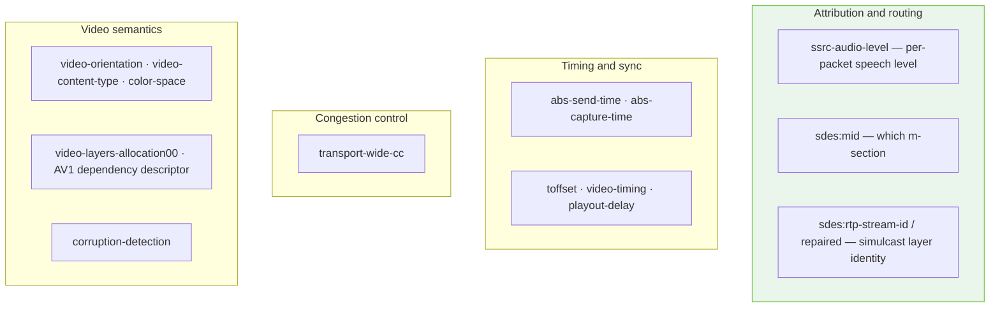

# Reference · RTP header extensions

The 20 extensions Meet declares, in the order it declares them.

👁 **Observed**, read off a captured `CreateMediaSession` request field `1.3.4`.

> **The ids are the numbers that appear in the RTP headers Meet sends back**, so
> changing one changes how every packet parses. Copy them verbatim rather than
> assigning your own.

---

## Encoding

Repeated at `1.3.4`:

```
1: id          the extension id used in RTP headers
2: uri
3: kind        1 = audio, 2 = video
4: flag        1 on nineteen; 2 on the twentieth
```

---

## Audio — 5 entries

| # | id | URI |
| --- | --- | --- |
| 1 | 1 | `urn:ietf:params:rtp-hdrext:ssrc-audio-level` |
| 2 | 2 | `http://www.webrtc.org/experiments/rtp-hdrext/abs-send-time` |
| 3 | 3 | `http://www.ietf.org/id/draft-holmer-rmcat-transport-wide-cc-extensions-01` |
| 4 | 4 | `urn:ietf:params:rtp-hdrext:sdes:mid` |
| 5 | 9 | `http://www.webrtc.org/experiments/rtp-hdrext/abs-capture-time` |

## Video — 15 entries

| # | id | URI | flag |
| --- | --- | --- | --- |
| 6 | 14 | `urn:ietf:params:rtp-hdrext:toffset` | 1 |
| 7 | 2 | `http://www.webrtc.org/experiments/rtp-hdrext/abs-send-time` | 1 |
| 8 | 13 | `urn:3gpp:video-orientation` | 1 |
| 9 | 3 | `http://www.ietf.org/id/draft-holmer-rmcat-transport-wide-cc-extensions-01` | 1 |
| 10 | 5 | `http://www.webrtc.org/experiments/rtp-hdrext/playout-delay` | 1 |
| 11 | 6 | `http://www.webrtc.org/experiments/rtp-hdrext/video-content-type` | 1 |
| 12 | 7 | `http://www.webrtc.org/experiments/rtp-hdrext/video-timing` | 1 |
| 13 | 8 | `http://www.webrtc.org/experiments/rtp-hdrext/color-space` | 1 |
| 14 | 4 | `urn:ietf:params:rtp-hdrext:sdes:mid` | 1 |
| 15 | 10 | `urn:ietf:params:rtp-hdrext:sdes:rtp-stream-id` | 1 |
| 16 | 11 | `urn:ietf:params:rtp-hdrext:sdes:repaired-rtp-stream-id` | 1 |
| 17 | 9 | `http://www.webrtc.org/experiments/rtp-hdrext/abs-capture-time` | 1 |
| 18 | 12 | `http://www.webrtc.org/experiments/rtp-hdrext/video-layers-allocation00` | 1 |
| 19 | 15 | `https://aomediacodec.github.io/av1-rtp-spec/#dependency-descriptor-rtp-header-extension` | 1 |
| 20 | 16 | `http://www.webrtc.org/experiments/rtp-hdrext/corruption-detection` | **2** |

---

## Things that are easy to get wrong

**The last entry is video, not audio.** An off-by-one in the catalogue puts a
video-only extension on the audio sections. Assert the split: **5 audio, 15
video, 20 total.**

**Nineteen carry `4: 1` and the twentieth carries `4: 2`.** Writing one value
everywhere is a difference no count-based test catches. Assert that exactly one
entry has flag 2, and that it is the last.

**Ids repeat across kinds and that is correct.** `abs-send-time` is id 2 for both
audio and video; `sdes:mid` is id 4 for both; `abs-capture-time` is id 9 for
both. `transport-wide-cc` is id 3 for both. This is normal — extension ids are
scoped per media section.

**A request with no extensions negotiates nothing useful.** No audio levels, no
bandwidth estimation, no mid — everything that makes a Meet stream readable.

---

## What each one gives you

Grouped by what a client building on this actually gets:



The one worth knowing about if you are building anything voice-related is
**`ssrc-audio-level` (id 1)**: it puts a speech level in every audio packet
header, so per-participant loudness and a rough voice-activity signal are
available **without decoding the audio at all**.

Note also `video-layers-allocation00` and the AV1 dependency descriptor — both
consistent with the temporal-layer scalability (`L1T2`/`L1T3`) seen in
`media-director` allocations. → [docs/07-media-director.md](../docs/07-media-director.md)

---

## As SDP

```
a=extmap:1 urn:ietf:params:rtp-hdrext:ssrc-audio-level
a=extmap:2 http://www.webrtc.org/experiments/rtp-hdrext/abs-send-time
…
```

on the sections matching each entry's kind.

👁 The browser's **assembled answer** carried **12** extensions, not 20 — the
answer is the negotiated subset, while the request declares everything the client
supports. Do not expect the two counts to match.
